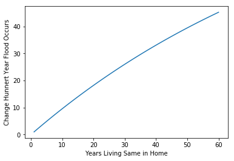

```python
# Dependencies
import numpy as np
import matplotlib.pyplot as plt
import pandas as pd
```


```python
# create range from 1 to 60 years
years_living_in_home = np.arange(1.0, 61.0, 1.0)
years_living_in_home
```


    array([  1.,   2.,   3.,   4.,   5.,   6.,   7.,   8.,   9.,  10.,  11.,
            12.,  13.,  14.,  15.,  16.,  17.,  18.,  19.,  20.,  21.,  22.,
            23.,  24.,  25.,  26.,  27.,  28.,  29.,  30.,  31.,  32.,  33.,
            34.,  35.,  36.,  37.,  38.,  39.,  40.,  41.,  42.,  43.,  44.,
            45.,  46.,  47.,  48.,  49.,  50.,  51.,  52.,  53.,  54.,  55.,
            56.,  57.,  58.,  59.,  60.])


```python
# compound probabilities, starting with exponent of 1
compounding_probability = (1.0 - (0.99**years_living_in_home))*100
compounding_probability
```


    array([  1.        ,   1.99      ,   2.9701    ,   3.940399  ,
             4.90099501,   5.85198506,   6.79346521,   7.72553056,
             8.64827525,   9.5617925 ,  10.46617457,  11.36151283,
            12.2478977 ,  13.12541872,  13.99416454,  14.85422289,
            15.70568066,  16.54862385,  17.38313762,  18.20930624,
            19.02721318,  19.83694105,  20.63857164,  21.43218592,
            22.21786406,  22.99568542,  23.76572857,  24.52807128,
            25.28279057,  26.02996266,  26.76966303,  27.5019664 ,
            28.22694674,  28.94467727,  29.6552305 ,  30.3586782 ,
            31.05509141,  31.7445405 ,  32.42709509,  33.10282414,
            33.7717959 ,  34.43407794,  35.08973716,  35.73883979,
            36.38145139,  37.01763688,  37.64746051,  38.27098591,
            38.88827605,  39.49939329,  40.10439935,  40.70335536,
            41.29632181,  41.88335859,  42.464525  ,  43.03987975,
            43.60948095,  44.17338615,  44.73165228,  45.28433576])


```python
# give the graph labels
plt.xlabel("Years Living Same in Home")
plt.ylabel("Change Hunnert Year Flood Occurs")

# plot the graph
plt.plot(years_living_in_home, compounding_probability)
# show the plot
plt.show()
```





```python

```
