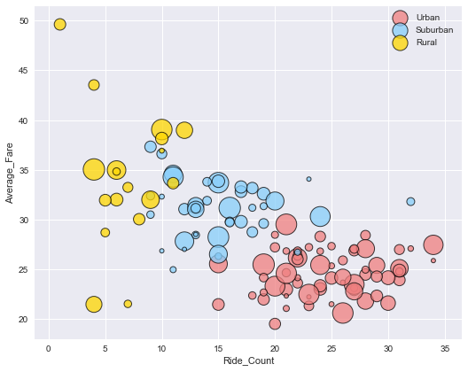
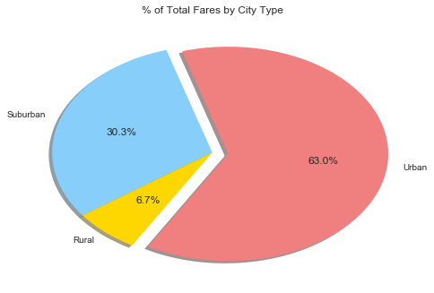
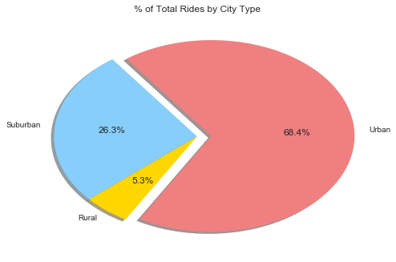
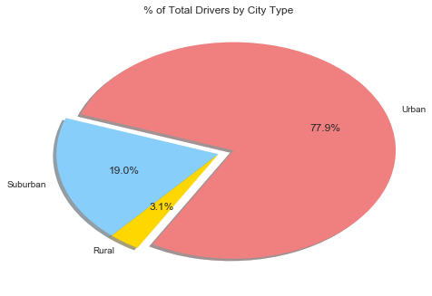

# Pyber Ride Sharing

## Analysis:
    - Rural drivers account for ~3% of the driver pool but earn ~6,7% of the fares, making them the most profitable
    - As the number of rides increases in an area, the cost of the fare generally decreases
    - Generally, it appears that - even without coloring - one can differentiate between Rural, Suburban, and Urban areas based on their grouping
    


```python
# Dependencies
import pandas as pd
import numpy as np
import matplotlib.pyplot as plt
import seaborn as sns
```


```python
# Import the files
filename = ('ride_data.csv')
ride_data_df = pd.read_csv(filename)

# Printed in first run through but will remove later
# ride_data_df.head(5)
```


```python
# Import the files
filename2 = ('city_data.csv')
city_df = pd.read_csv(filename2)

# Glad to have seen this in the help requests!  Drops the duplicate city names
city_data_df = city_df.drop_duplicates('city', keep = 'first')

# Printed in first run through but will remove later
# city_data_df.head(5)

```


```python
# Merge the two DF's on city as it is the column header that occurs in both
combined_df = pd.merge(city_data_df, ride_data_df, how='outer', on='city')
# combined_df.head(5)

```


```python
driver_count = combined_df.groupby('city')
```


```python
#Average Fare ($) Per City

# Create New DF for average fare per city
avg_fare = (combined_df
      # group DF by city column
      .groupby(['city'], as_index = False)
      .fare
      # Perform calculations as directed by instructions
      .agg({'Average_Fare':np.mean, 'Ride_Count': 'count'
           })
     )

# Remove extra decimals as this is currency
avg_fare['Average_Fare'] = round(avg_fare["Average_Fare"], 2)

# Print that DF
avg_fare.head(5)

```


<div>
<style>
    .dataframe thead tr:only-child th {
        text-align: right;
    }

    .dataframe thead th {
        text-align: left;
    }

    .dataframe tbody tr th {
        vertical-align: top;
    }
</style>
<table border="1" class="dataframe">
  <thead>
    <tr style="text-align: right;">
      <th></th>
      <th>city</th>
      <th>Average_Fare</th>
      <th>Ride_Count</th>
    </tr>
  </thead>
  <tbody>
    <tr>
      <th>0</th>
      <td>Alvarezhaven</td>
      <td>23.93</td>
      <td>31</td>
    </tr>
    <tr>
      <th>1</th>
      <td>Alyssaberg</td>
      <td>20.61</td>
      <td>26</td>
    </tr>
    <tr>
      <th>2</th>
      <td>Anitamouth</td>
      <td>37.32</td>
      <td>9</td>
    </tr>
    <tr>
      <th>3</th>
      <td>Antoniomouth</td>
      <td>23.62</td>
      <td>22</td>
    </tr>
    <tr>
      <th>4</th>
      <td>Aprilchester</td>
      <td>21.98</td>
      <td>19</td>
    </tr>
  </tbody>
</table>
</div>


```python
# Merge the two DF's on city as it is the column header that occurs in both
new_combined_df = pd.merge(avg_fare, city_data_df, how='outer', on='city')
#new_combined_df.head(5)
```


```python
#print(new_combined_df.dtypes)
```


```python
new_combined_df['driver_count'] = new_combined_df['driver_count'].astype('float')

#new_combined_df.head(10)
```


# Bubble Plot of Ride Sharing Data


```python
# declaring 's' to be driver count so that I can pass it into seaborn as a size argument
s = new_combined_df['driver_count']

# Using seaborn lmplot to make the chart
sns.lmplot(x='Ride_Count', y='Average_Fare', fit_reg = False,
              data=new_combined_df , hue = 'type', size = 6, aspect = 1.25,
           palette=dict(Urban="lightcoral", Suburban="lightskyblue", Rural="Gold"),
          
           # USING SCATTER_KWS TO PASS MATPLOTLIB DICTIONARIES INTO SEABORN!!
           scatter_kws={"marker": "D", # Set marker style
                        "s": s*8,
                       'edgecolor': 'black', 
                        'linewidth': 1,
                        'alpha': 0.75,
                       },# S marker size
           legend = False,
           )
# make labels for the legend
labels = ['Urban', 'Suburban', 'Rural']

plt.legend()
plt.show()
```





# Total Fares by City Type


```python
# Create New DF for average fare per city
fares_per_type = (combined_df
      # group DF by city column
      .groupby(['type'], as_index = False)
      .fare
      # Perform calculations as directed by instructions
      .agg({'Bigger_Count':'sum'#, 'Ride Count': 'count'
           })
     )

# uses iloc to assign values calulcated in the grouped DF
Rural = fares_per_type.iloc[0, 1]
Suburban = fares_per_type.iloc[1, 1]
Urban = fares_per_type.iloc[2, 1]

# remove hash below to check maths
#fares_per_type

```


```python
# Labels for the sections of our pie chart
labels = ["Urban", 'Suburban', 'Rural']

# The values of each section of the pie chart
fares = [Urban, Suburban, Rural]

# The colors of each section of the pie chart
colors = ["lightcoral", "lightskyblue", "Gold"]

plt.title('% of Total Fares by City Type')
# Tells matplotlib to seperate the "Python" section from the others
explode = (0.1, 0, 0)

# Creates the pie chart based upon the values above
# Automatically finds the percentages of each part of the pie chart
plt.pie(fares, explode=explode, labels=labels, colors=colors,
        autopct="%1.1f%%", shadow=True, startangle=240)


# Prints our pie chart to the screen
plt.show()

```





# Total Rides by City Type


```python
# Create New DF for average fare per city
rides_per_type = (new_combined_df
      # group DF by city column
      .groupby(['type'], as_index = False)
      .Ride_Count
      # Perform calculations as directed by instructions
      .agg({'Bigger_Count':'sum'
           })
     )

# uses iloc to assign values calulcated in the grouped DF
Rural = rides_per_type.iloc[0, 1]
Suburban = rides_per_type.iloc[1, 1]
Urban = rides_per_type.iloc[2, 1]

# Labels for the sections of our pie chart
labels = ["Urban", 'Suburban', 'Rural']

# The values of each section of the pie chart
rides = [Urban, Suburban, Rural]

# The colors of each section of the pie chart
colors = ["lightcoral", "lightskyblue", "Gold"]
plt.title('% of Total Rides by City Type')

# Tells matplotlib to seperate the "Python" section from the others
explode = (0.1, 0, 0)

# Creates the pie chart based upon the values above
# Automatically finds the percentages of each part of the pie chart
plt.pie(rides, explode=explode, labels=labels, colors=colors,
        autopct="%1.1f%%", shadow=True, startangle=240)

# Prints our pie chart to the screen
plt.show()

```





# Total Drivers by City Type


```python
# Create New DF for average fare per city
drivers_per_type = (new_combined_df
      # group DF by city column
      .groupby(['type'], as_index = False)
      .driver_count
      # Perform calculations as directed by instructions
      .agg({'Bigger_Count':'sum'#, 'Ride Count': 'count'
           })
     )

# uses iloc to assign values calulcated in the grouped DF
Rural = drivers_per_type.iloc[0, 1]
Suburban = drivers_per_type.iloc[1, 1]
Urban = drivers_per_type.iloc[2, 1]

# remove hash below to check maths
#drivers_per_type
```


```python
# Labels pie chart
labels = ["Urban", 'Suburban', 'Rural']

# The values of each pie pie chart
drivers = [Urban, Suburban, Rural]
colors = ["lightcoral", "lightskyblue", "Gold"]
plt.title('% of Total Drivers by City Type')
explode = (0.1, 0, 0)

# Creates the pie chart based upon the values above
# Automatically finds the percentages of each part of the pie chart
plt.pie(drivers, explode=explode, labels=labels, colors=colors,
        autopct="%1.1f%%", shadow=True, startangle=240)
plt.show()
```





```python

```
