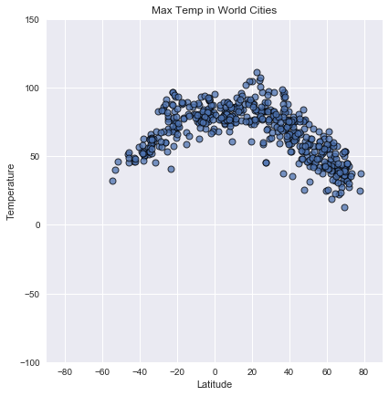
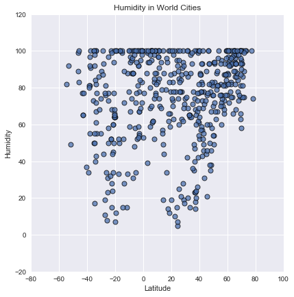
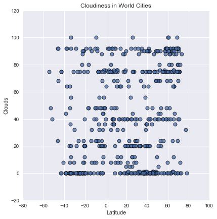
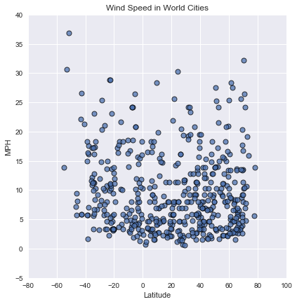
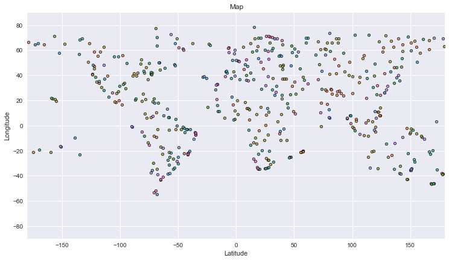

# WeatherPy

## Observations:
    - The minimum observed humidity at the equator is higher than values observed at other latitudes.
    - The temperature versus latitude plot has a parabolic shape, indicating that temperature peak at the equator and decrease as latitude diverts from zero.  Also, the plot is not perfectly centered over zero, leading me to believe this is due to the offset of the earth's axis inducing seasonal changes
    - The heavy concentration of points with latitudes greater than 0 degrees indicates that there are a greater number of cities in the northern hemisphere, and it would logically follow that population is also greater than in the southern hemisphere.


```python
# Dependencies
import csv
import matplotlib.pyplot as plt
import requests as req
import pandas as pd
import seaborn as sns
from citipy import citipy
from random import randrange
import time
from random import uniform
```

# Generate Cities List


```python
# List to hold cities 
cities = []
# Use varaible c to keep track of unique city names
c=0

# While loop ensures that we get at least 500 unique city names
while c < 500:
    # Loop to generate longitudes, latitudes
    for x in range(0, 50):
        # Generate range longitudes and latitudes
        x_lat = uniform(-90.00, 90.00)
        y_lon = uniform(-180.00, 180.00)
        
        # Import the cities based on the longitude and latitude
        cities.append(citipy.nearest_city(x_lat, y_lon).city_name)
    
    # Create the cities DF
    cities_df = pd.DataFrame(cities)
    
    # Drop duplicate city names
    cities_df = cities_df.drop_duplicates(subset = 0, keep = 'first')
    
    # Count how many cities are in the set
    c = len(cities_df)
# Sample DF    
cities_df.head(5)
```


<div>
<style>
    .dataframe thead tr:only-child th {
        text-align: right;
    }

    .dataframe thead th {
        text-align: left;
    }

    .dataframe tbody tr th {
        vertical-align: top;
    }
</style>
<table border="1" class="dataframe">
  <thead>
    <tr style="text-align: right;">
      <th></th>
      <th>0</th>
    </tr>
  </thead>
  <tbody>
    <tr>
      <th>0</th>
      <td>yumen</td>
    </tr>
    <tr>
      <th>1</th>
      <td>mayumba</td>
    </tr>
    <tr>
      <th>2</th>
      <td>albany</td>
    </tr>
    <tr>
      <th>3</th>
      <td>busselton</td>
    </tr>
    <tr>
      <th>4</th>
      <td>illoqqortoormiut</td>
    </tr>
  </tbody>
</table>
</div>


```python
# Get number of cities generated
len(cities_df)
```


    504


```python
# Name the columns for the DF
cities_df['humidity'] = ''
cities_df['temp'] = ''
cities_df['wind'] = ''
cities_df['clouds'] = ''
cities_df['press'] = ''
cities_df['name'] = ''
cities_df['lat'] = ''
cities_df['lon'] = ''

cities_df.head(5)
```


<div>
<style>
    .dataframe thead tr:only-child th {
        text-align: right;
    }

    .dataframe thead th {
        text-align: left;
    }

    .dataframe tbody tr th {
        vertical-align: top;
    }
</style>
<table border="1" class="dataframe">
  <thead>
    <tr style="text-align: right;">
      <th></th>
      <th>0</th>
      <th>humidity</th>
      <th>temp</th>
      <th>wind</th>
      <th>clouds</th>
      <th>press</th>
      <th>name</th>
      <th>lat</th>
      <th>lon</th>
    </tr>
  </thead>
  <tbody>
    <tr>
      <th>0</th>
      <td>yumen</td>
      <td></td>
      <td></td>
      <td></td>
      <td></td>
      <td></td>
      <td></td>
      <td></td>
      <td></td>
    </tr>
    <tr>
      <th>1</th>
      <td>mayumba</td>
      <td></td>
      <td></td>
      <td></td>
      <td></td>
      <td></td>
      <td></td>
      <td></td>
      <td></td>
    </tr>
    <tr>
      <th>2</th>
      <td>albany</td>
      <td></td>
      <td></td>
      <td></td>
      <td></td>
      <td></td>
      <td></td>
      <td></td>
      <td></td>
    </tr>
    <tr>
      <th>3</th>
      <td>busselton</td>
      <td></td>
      <td></td>
      <td></td>
      <td></td>
      <td></td>
      <td></td>
      <td></td>
      <td></td>
    </tr>
    <tr>
      <th>4</th>
      <td>illoqqortoormiut</td>
      <td></td>
      <td></td>
      <td></td>
      <td></td>
      <td></td>
      <td></td>
      <td></td>
      <td></td>
    </tr>
  </tbody>
</table>
</div>


```python
# Save config information.
api_key = "b63fc0fd1354fd3ad6fba4757309f1f8"
url = "http://api.openweathermap.org/data/2.5/weather?"
units = "Imperial"
```

# Perform API Calls


```python
counter = 0

# Populate the DF
for index, row in cities_df.iterrows():
    try:
        # Counter keeps track of where we are in record retrieval process
        counter += 1
        # Print progress to keep user updated
        print('Retreieving record ' + str(counter) + ' of ' + str(c))
        # Build the URL query
        query_url = url + "appid=" + api_key + "&units=" + units + "&q=" + (row[0])
        cities_lat_lng = req.get(query_url).json()
        #Populate the DF
        cities_df.set_value(index, "lat", cities_lat_lng["coord"]["lat"])
        cities_df.set_value(index, "lon", cities_lat_lng["coord"]["lon"])
        cities_df.set_value(index, 'press', cities_lat_lng['main']['pressure'])
        cities_df.set_value(index, 'temp', cities_lat_lng['main']['temp_max'])
        cities_df.set_value(index, 'humidity', cities_lat_lng['main']['humidity'])
        cities_df.set_value(index, 'clouds', cities_lat_lng['clouds']['all'])
        cities_df.set_value(index, 'wind', cities_lat_lng['wind']['speed'])
        cities_df.set_value(index, 'name', cities_lat_lng['name'])
    except:
        print('Missing informtion.....skipping')   
    
    print(query_url)
    # Add a delay so we don't get banned from weather API
    time.sleep(1)
```

    Retreieving record 1 of 504
    http://api.openweathermap.org/data/2.5/weather?appid=b63fc0fd1354fd3ad6fba4757309f1f8&units=Imperial&q=yumen
    Retreieving record 2 of 504
    http://api.openweathermap.org/data/2.5/weather?appid=b63fc0fd1354fd3ad6fba4757309f1f8&units=Imperial&q=mayumba
    Retreieving record 3 of 504
    http://api.openweathermap.org/data/2.5/weather?appid=b63fc0fd1354fd3ad6fba4757309f1f8&units=Imperial&q=albany
    Retreieving record 4 of 504
    http://api.openweathermap.org/data/2.5/weather?appid=b63fc0fd1354fd3ad6fba4757309f1f8&units=Imperial&q=busselton
    Retreieving record 5 of 504
    http://api.openweathermap.org/data/2.5/weather?appid=b63fc0fd1354fd3ad6fba4757309f1f8&units=Imperial&q=illoqqortoormiut
    Retreieving record 6 of 504
    http://api.openweathermap.org/data/2.5/weather?appid=b63fc0fd1354fd3ad6fba4757309f1f8&units=Imperial&q=novyy urgal
    Retreieving record 7 of 504
    http://api.openweathermap.org/data/2.5/weather?appid=b63fc0fd1354fd3ad6fba4757309f1f8&units=Imperial&q=jamestown
    Retreieving record 8 of 504
    http://api.openweathermap.org/data/2.5/weather?appid=b63fc0fd1354fd3ad6fba4757309f1f8&units=Imperial&q=nanortalik
    Retreieving record 9 of 504
    http://api.openweathermap.org/data/2.5/weather?appid=b63fc0fd1354fd3ad6fba4757309f1f8&units=Imperial&q=marcona
    Retreieving record 10 of 504
    http://api.openweathermap.org/data/2.5/weather?appid=b63fc0fd1354fd3ad6fba4757309f1f8&units=Imperial&q=paamiut
    Retreieving record 11 of 504
    http://api.openweathermap.org/data/2.5/weather?appid=b63fc0fd1354fd3ad6fba4757309f1f8&units=Imperial&q=quebo
    Retreieving record 12 of 504
    http://api.openweathermap.org/data/2.5/weather?appid=b63fc0fd1354fd3ad6fba4757309f1f8&units=Imperial&q=mys shmidta
    Retreieving record 13 of 504
    http://api.openweathermap.org/data/2.5/weather?appid=b63fc0fd1354fd3ad6fba4757309f1f8&units=Imperial&q=iqaluit
    Retreieving record 14 of 504
    http://api.openweathermap.org/data/2.5/weather?appid=b63fc0fd1354fd3ad6fba4757309f1f8&units=Imperial&q=saint-philippe
    Retreieving record 15 of 504
    http://api.openweathermap.org/data/2.5/weather?appid=b63fc0fd1354fd3ad6fba4757309f1f8&units=Imperial&q=clyde river
    Retreieving record 16 of 504
    http://api.openweathermap.org/data/2.5/weather?appid=b63fc0fd1354fd3ad6fba4757309f1f8&units=Imperial&q=bluff
    Retreieving record 17 of 504
    http://api.openweathermap.org/data/2.5/weather?appid=b63fc0fd1354fd3ad6fba4757309f1f8&units=Imperial&q=saint-pierre
    Retreieving record 18 of 504
    http://api.openweathermap.org/data/2.5/weather?appid=b63fc0fd1354fd3ad6fba4757309f1f8&units=Imperial&q=umzimvubu
    Retreieving record 19 of 504
    http://api.openweathermap.org/data/2.5/weather?appid=b63fc0fd1354fd3ad6fba4757309f1f8&units=Imperial&q=punta arenas
    Retreieving record 20 of 504
    http://api.openweathermap.org/data/2.5/weather?appid=b63fc0fd1354fd3ad6fba4757309f1f8&units=Imperial&q=mwinilunga
    Retreieving record 21 of 504
    http://api.openweathermap.org/data/2.5/weather?appid=b63fc0fd1354fd3ad6fba4757309f1f8&units=Imperial&q=hilo
    Retreieving record 22 of 504
    http://api.openweathermap.org/data/2.5/weather?appid=b63fc0fd1354fd3ad6fba4757309f1f8&units=Imperial&q=bafia
    Retreieving record 23 of 504
    http://api.openweathermap.org/data/2.5/weather?appid=b63fc0fd1354fd3ad6fba4757309f1f8&units=Imperial&q=mataura
    Retreieving record 24 of 504
    http://api.openweathermap.org/data/2.5/weather?appid=b63fc0fd1354fd3ad6fba4757309f1f8&units=Imperial&q=peniche
    Retreieving record 25 of 504
    http://api.openweathermap.org/data/2.5/weather?appid=b63fc0fd1354fd3ad6fba4757309f1f8&units=Imperial&q=mar del plata
    Retreieving record 26 of 504
    http://api.openweathermap.org/data/2.5/weather?appid=b63fc0fd1354fd3ad6fba4757309f1f8&units=Imperial&q=provideniya
    Retreieving record 27 of 504
    http://api.openweathermap.org/data/2.5/weather?appid=b63fc0fd1354fd3ad6fba4757309f1f8&units=Imperial&q=okhotsk
    Retreieving record 28 of 504
    http://api.openweathermap.org/data/2.5/weather?appid=b63fc0fd1354fd3ad6fba4757309f1f8&units=Imperial&q=kapaa
    Retreieving record 29 of 504
    http://api.openweathermap.org/data/2.5/weather?appid=b63fc0fd1354fd3ad6fba4757309f1f8&units=Imperial&q=leningradskiy
    Retreieving record 30 of 504
    http://api.openweathermap.org/data/2.5/weather?appid=b63fc0fd1354fd3ad6fba4757309f1f8&units=Imperial&q=chuy
    Retreieving record 31 of 504
    http://api.openweathermap.org/data/2.5/weather?appid=b63fc0fd1354fd3ad6fba4757309f1f8&units=Imperial&q=peikang
    Retreieving record 32 of 504
    http://api.openweathermap.org/data/2.5/weather?appid=b63fc0fd1354fd3ad6fba4757309f1f8&units=Imperial&q=touros
    Retreieving record 33 of 504
    http://api.openweathermap.org/data/2.5/weather?appid=b63fc0fd1354fd3ad6fba4757309f1f8&units=Imperial&q=nishihara
    Retreieving record 34 of 504
    http://api.openweathermap.org/data/2.5/weather?appid=b63fc0fd1354fd3ad6fba4757309f1f8&units=Imperial&q=bambous virieux
    Retreieving record 35 of 504
    http://api.openweathermap.org/data/2.5/weather?appid=b63fc0fd1354fd3ad6fba4757309f1f8&units=Imperial&q=rikitea
    Retreieving record 36 of 504
    http://api.openweathermap.org/data/2.5/weather?appid=b63fc0fd1354fd3ad6fba4757309f1f8&units=Imperial&q=mahebourg
    Retreieving record 37 of 504
    http://api.openweathermap.org/data/2.5/weather?appid=b63fc0fd1354fd3ad6fba4757309f1f8&units=Imperial&q=dikson
    Retreieving record 38 of 504
    http://api.openweathermap.org/data/2.5/weather?appid=b63fc0fd1354fd3ad6fba4757309f1f8&units=Imperial&q=saldanha
    Retreieving record 39 of 504
    http://api.openweathermap.org/data/2.5/weather?appid=b63fc0fd1354fd3ad6fba4757309f1f8&units=Imperial&q=barrow
    Retreieving record 40 of 504
    http://api.openweathermap.org/data/2.5/weather?appid=b63fc0fd1354fd3ad6fba4757309f1f8&units=Imperial&q=mmabatho
    Retreieving record 41 of 504
    http://api.openweathermap.org/data/2.5/weather?appid=b63fc0fd1354fd3ad6fba4757309f1f8&units=Imperial&q=dunedin
    Retreieving record 42 of 504
    http://api.openweathermap.org/data/2.5/weather?appid=b63fc0fd1354fd3ad6fba4757309f1f8&units=Imperial&q=magadan
    Retreieving record 43 of 504
    http://api.openweathermap.org/data/2.5/weather?appid=b63fc0fd1354fd3ad6fba4757309f1f8&units=Imperial&q=ambovombe
    Retreieving record 44 of 504
    http://api.openweathermap.org/data/2.5/weather?appid=b63fc0fd1354fd3ad6fba4757309f1f8&units=Imperial&q=jiddah
    Retreieving record 45 of 504
    http://api.openweathermap.org/data/2.5/weather?appid=b63fc0fd1354fd3ad6fba4757309f1f8&units=Imperial&q=taoudenni
    Retreieving record 46 of 504
    http://api.openweathermap.org/data/2.5/weather?appid=b63fc0fd1354fd3ad6fba4757309f1f8&units=Imperial&q=kaitangata
    Retreieving record 47 of 504
    http://api.openweathermap.org/data/2.5/weather?appid=b63fc0fd1354fd3ad6fba4757309f1f8&units=Imperial&q=puerto ayora
    Retreieving record 48 of 504
    http://api.openweathermap.org/data/2.5/weather?appid=b63fc0fd1354fd3ad6fba4757309f1f8&units=Imperial&q=vaini
    Retreieving record 49 of 504
    http://api.openweathermap.org/data/2.5/weather?appid=b63fc0fd1354fd3ad6fba4757309f1f8&units=Imperial&q=tarauaca
    Retreieving record 50 of 504
    http://api.openweathermap.org/data/2.5/weather?appid=b63fc0fd1354fd3ad6fba4757309f1f8&units=Imperial&q=sao joao da barra
    Retreieving record 51 of 504
    http://api.openweathermap.org/data/2.5/weather?appid=b63fc0fd1354fd3ad6fba4757309f1f8&units=Imperial&q=hobart
    Retreieving record 52 of 504
    http://api.openweathermap.org/data/2.5/weather?appid=b63fc0fd1354fd3ad6fba4757309f1f8&units=Imperial&q=kavieng
    Retreieving record 53 of 504
    http://api.openweathermap.org/data/2.5/weather?appid=b63fc0fd1354fd3ad6fba4757309f1f8&units=Imperial&q=qaanaaq
    Retreieving record 54 of 504
    http://api.openweathermap.org/data/2.5/weather?appid=b63fc0fd1354fd3ad6fba4757309f1f8&units=Imperial&q=kodiak
    Retreieving record 55 of 504
    http://api.openweathermap.org/data/2.5/weather?appid=b63fc0fd1354fd3ad6fba4757309f1f8&units=Imperial&q=marawi
    Retreieving record 56 of 504
    http://api.openweathermap.org/data/2.5/weather?appid=b63fc0fd1354fd3ad6fba4757309f1f8&units=Imperial&q=pontalina
    Retreieving record 57 of 504
    http://api.openweathermap.org/data/2.5/weather?appid=b63fc0fd1354fd3ad6fba4757309f1f8&units=Imperial&q=lebu
    Retreieving record 58 of 504
    http://api.openweathermap.org/data/2.5/weather?appid=b63fc0fd1354fd3ad6fba4757309f1f8&units=Imperial&q=tolosa
    Retreieving record 59 of 504
    http://api.openweathermap.org/data/2.5/weather?appid=b63fc0fd1354fd3ad6fba4757309f1f8&units=Imperial&q=berlevag
    Retreieving record 60 of 504
    http://api.openweathermap.org/data/2.5/weather?appid=b63fc0fd1354fd3ad6fba4757309f1f8&units=Imperial&q=high level
    Retreieving record 61 of 504
    http://api.openweathermap.org/data/2.5/weather?appid=b63fc0fd1354fd3ad6fba4757309f1f8&units=Imperial&q=khatanga
    Retreieving record 62 of 504
    http://api.openweathermap.org/data/2.5/weather?appid=b63fc0fd1354fd3ad6fba4757309f1f8&units=Imperial&q=avarua
    Retreieving record 63 of 504
    http://api.openweathermap.org/data/2.5/weather?appid=b63fc0fd1354fd3ad6fba4757309f1f8&units=Imperial&q=pirovskoye
    Retreieving record 64 of 504
    http://api.openweathermap.org/data/2.5/weather?appid=b63fc0fd1354fd3ad6fba4757309f1f8&units=Imperial&q=cherskiy
    Retreieving record 65 of 504
    http://api.openweathermap.org/data/2.5/weather?appid=b63fc0fd1354fd3ad6fba4757309f1f8&units=Imperial&q=natal
    Retreieving record 66 of 504
    http://api.openweathermap.org/data/2.5/weather?appid=b63fc0fd1354fd3ad6fba4757309f1f8&units=Imperial&q=kawana waters
    Retreieving record 67 of 504
    http://api.openweathermap.org/data/2.5/weather?appid=b63fc0fd1354fd3ad6fba4757309f1f8&units=Imperial&q=fuerte olimpo
    Retreieving record 68 of 504
    http://api.openweathermap.org/data/2.5/weather?appid=b63fc0fd1354fd3ad6fba4757309f1f8&units=Imperial&q=nikolskoye
    Retreieving record 69 of 504
    http://api.openweathermap.org/data/2.5/weather?appid=b63fc0fd1354fd3ad6fba4757309f1f8&units=Imperial&q=bosaso
    Retreieving record 70 of 504
    http://api.openweathermap.org/data/2.5/weather?appid=b63fc0fd1354fd3ad6fba4757309f1f8&units=Imperial&q=bubaque
    Retreieving record 71 of 504
    http://api.openweathermap.org/data/2.5/weather?appid=b63fc0fd1354fd3ad6fba4757309f1f8&units=Imperial&q=lompoc
    Retreieving record 72 of 504
    http://api.openweathermap.org/data/2.5/weather?appid=b63fc0fd1354fd3ad6fba4757309f1f8&units=Imperial&q=cockburn town
    Retreieving record 73 of 504
    http://api.openweathermap.org/data/2.5/weather?appid=b63fc0fd1354fd3ad6fba4757309f1f8&units=Imperial&q=vardo
    Retreieving record 74 of 504
    http://api.openweathermap.org/data/2.5/weather?appid=b63fc0fd1354fd3ad6fba4757309f1f8&units=Imperial&q=belushya guba
    Retreieving record 75 of 504
    http://api.openweathermap.org/data/2.5/weather?appid=b63fc0fd1354fd3ad6fba4757309f1f8&units=Imperial&q=galle
    Retreieving record 76 of 504
    http://api.openweathermap.org/data/2.5/weather?appid=b63fc0fd1354fd3ad6fba4757309f1f8&units=Imperial&q=atuona
    Retreieving record 77 of 504
    http://api.openweathermap.org/data/2.5/weather?appid=b63fc0fd1354fd3ad6fba4757309f1f8&units=Imperial&q=tessalit
    Retreieving record 78 of 504
    http://api.openweathermap.org/data/2.5/weather?appid=b63fc0fd1354fd3ad6fba4757309f1f8&units=Imperial&q=lyuban
    Retreieving record 79 of 504
    http://api.openweathermap.org/data/2.5/weather?appid=b63fc0fd1354fd3ad6fba4757309f1f8&units=Imperial&q=schruns
    Retreieving record 80 of 504
    http://api.openweathermap.org/data/2.5/weather?appid=b63fc0fd1354fd3ad6fba4757309f1f8&units=Imperial&q=grand gaube
    Retreieving record 81 of 504
    http://api.openweathermap.org/data/2.5/weather?appid=b63fc0fd1354fd3ad6fba4757309f1f8&units=Imperial&q=honiara
    Retreieving record 82 of 504
    http://api.openweathermap.org/data/2.5/weather?appid=b63fc0fd1354fd3ad6fba4757309f1f8&units=Imperial&q=itoman
    Retreieving record 83 of 504
    http://api.openweathermap.org/data/2.5/weather?appid=b63fc0fd1354fd3ad6fba4757309f1f8&units=Imperial&q=port hardy
    Retreieving record 84 of 504
    http://api.openweathermap.org/data/2.5/weather?appid=b63fc0fd1354fd3ad6fba4757309f1f8&units=Imperial&q=chapais
    Retreieving record 85 of 504
    http://api.openweathermap.org/data/2.5/weather?appid=b63fc0fd1354fd3ad6fba4757309f1f8&units=Imperial&q=abonnema
    Retreieving record 86 of 504
    http://api.openweathermap.org/data/2.5/weather?appid=b63fc0fd1354fd3ad6fba4757309f1f8&units=Imperial&q=halalo
    Retreieving record 87 of 504
    http://api.openweathermap.org/data/2.5/weather?appid=b63fc0fd1354fd3ad6fba4757309f1f8&units=Imperial&q=klaksvik
    Retreieving record 88 of 504
    http://api.openweathermap.org/data/2.5/weather?appid=b63fc0fd1354fd3ad6fba4757309f1f8&units=Imperial&q=koppies
    Retreieving record 89 of 504
    http://api.openweathermap.org/data/2.5/weather?appid=b63fc0fd1354fd3ad6fba4757309f1f8&units=Imperial&q=hermanus
    Retreieving record 90 of 504
    http://api.openweathermap.org/data/2.5/weather?appid=b63fc0fd1354fd3ad6fba4757309f1f8&units=Imperial&q=constitucion
    Retreieving record 91 of 504
    http://api.openweathermap.org/data/2.5/weather?appid=b63fc0fd1354fd3ad6fba4757309f1f8&units=Imperial&q=ushuaia
    Retreieving record 92 of 504
    http://api.openweathermap.org/data/2.5/weather?appid=b63fc0fd1354fd3ad6fba4757309f1f8&units=Imperial&q=peterhead
    Retreieving record 93 of 504
    http://api.openweathermap.org/data/2.5/weather?appid=b63fc0fd1354fd3ad6fba4757309f1f8&units=Imperial&q=ryotsu
    Retreieving record 94 of 504
    http://api.openweathermap.org/data/2.5/weather?appid=b63fc0fd1354fd3ad6fba4757309f1f8&units=Imperial&q=cape coast
    Retreieving record 95 of 504
    http://api.openweathermap.org/data/2.5/weather?appid=b63fc0fd1354fd3ad6fba4757309f1f8&units=Imperial&q=padang
    Retreieving record 96 of 504
    http://api.openweathermap.org/data/2.5/weather?appid=b63fc0fd1354fd3ad6fba4757309f1f8&units=Imperial&q=bengkulu
    Retreieving record 97 of 504
    http://api.openweathermap.org/data/2.5/weather?appid=b63fc0fd1354fd3ad6fba4757309f1f8&units=Imperial&q=tonantins
    Retreieving record 98 of 504
    http://api.openweathermap.org/data/2.5/weather?appid=b63fc0fd1354fd3ad6fba4757309f1f8&units=Imperial&q=tumannyy
    Retreieving record 99 of 504
    http://api.openweathermap.org/data/2.5/weather?appid=b63fc0fd1354fd3ad6fba4757309f1f8&units=Imperial&q=airai
    Retreieving record 100 of 504
    http://api.openweathermap.org/data/2.5/weather?appid=b63fc0fd1354fd3ad6fba4757309f1f8&units=Imperial&q=samusu
    Retreieving record 101 of 504
    http://api.openweathermap.org/data/2.5/weather?appid=b63fc0fd1354fd3ad6fba4757309f1f8&units=Imperial&q=port alfred
    Retreieving record 102 of 504
    http://api.openweathermap.org/data/2.5/weather?appid=b63fc0fd1354fd3ad6fba4757309f1f8&units=Imperial&q=kapuskasing
    Retreieving record 103 of 504
    http://api.openweathermap.org/data/2.5/weather?appid=b63fc0fd1354fd3ad6fba4757309f1f8&units=Imperial&q=tromso
    Retreieving record 104 of 504
    http://api.openweathermap.org/data/2.5/weather?appid=b63fc0fd1354fd3ad6fba4757309f1f8&units=Imperial&q=dukat
    Retreieving record 105 of 504
    http://api.openweathermap.org/data/2.5/weather?appid=b63fc0fd1354fd3ad6fba4757309f1f8&units=Imperial&q=maniitsoq
    Retreieving record 106 of 504
    http://api.openweathermap.org/data/2.5/weather?appid=b63fc0fd1354fd3ad6fba4757309f1f8&units=Imperial&q=brae
    Retreieving record 107 of 504
    http://api.openweathermap.org/data/2.5/weather?appid=b63fc0fd1354fd3ad6fba4757309f1f8&units=Imperial&q=mitsamiouli
    Retreieving record 108 of 504
    http://api.openweathermap.org/data/2.5/weather?appid=b63fc0fd1354fd3ad6fba4757309f1f8&units=Imperial&q=hithadhoo
    Retreieving record 109 of 504
    http://api.openweathermap.org/data/2.5/weather?appid=b63fc0fd1354fd3ad6fba4757309f1f8&units=Imperial&q=cape town
    Retreieving record 110 of 504
    http://api.openweathermap.org/data/2.5/weather?appid=b63fc0fd1354fd3ad6fba4757309f1f8&units=Imperial&q=srednekolymsk
    Retreieving record 111 of 504
    http://api.openweathermap.org/data/2.5/weather?appid=b63fc0fd1354fd3ad6fba4757309f1f8&units=Imperial&q=houston
    Retreieving record 112 of 504
    http://api.openweathermap.org/data/2.5/weather?appid=b63fc0fd1354fd3ad6fba4757309f1f8&units=Imperial&q=broken hill
    Retreieving record 113 of 504
    http://api.openweathermap.org/data/2.5/weather?appid=b63fc0fd1354fd3ad6fba4757309f1f8&units=Imperial&q=mastic beach
    Retreieving record 114 of 504
    http://api.openweathermap.org/data/2.5/weather?appid=b63fc0fd1354fd3ad6fba4757309f1f8&units=Imperial&q=palabuhanratu
    Retreieving record 115 of 504
    http://api.openweathermap.org/data/2.5/weather?appid=b63fc0fd1354fd3ad6fba4757309f1f8&units=Imperial&q=pandan
    Retreieving record 116 of 504
    http://api.openweathermap.org/data/2.5/weather?appid=b63fc0fd1354fd3ad6fba4757309f1f8&units=Imperial&q=camacha
    Retreieving record 117 of 504
    http://api.openweathermap.org/data/2.5/weather?appid=b63fc0fd1354fd3ad6fba4757309f1f8&units=Imperial&q=cidreira
    Retreieving record 118 of 504
    http://api.openweathermap.org/data/2.5/weather?appid=b63fc0fd1354fd3ad6fba4757309f1f8&units=Imperial&q=arraial do cabo
    Retreieving record 119 of 504
    http://api.openweathermap.org/data/2.5/weather?appid=b63fc0fd1354fd3ad6fba4757309f1f8&units=Imperial&q=hami
    Retreieving record 120 of 504
    http://api.openweathermap.org/data/2.5/weather?appid=b63fc0fd1354fd3ad6fba4757309f1f8&units=Imperial&q=taolanaro
    Retreieving record 121 of 504
    http://api.openweathermap.org/data/2.5/weather?appid=b63fc0fd1354fd3ad6fba4757309f1f8&units=Imperial&q=vostok
    Retreieving record 122 of 504
    http://api.openweathermap.org/data/2.5/weather?appid=b63fc0fd1354fd3ad6fba4757309f1f8&units=Imperial&q=kuala terengganu
    Retreieving record 123 of 504
    http://api.openweathermap.org/data/2.5/weather?appid=b63fc0fd1354fd3ad6fba4757309f1f8&units=Imperial&q=ilulissat
    Retreieving record 124 of 504
    http://api.openweathermap.org/data/2.5/weather?appid=b63fc0fd1354fd3ad6fba4757309f1f8&units=Imperial&q=georgetown
    Retreieving record 125 of 504
    http://api.openweathermap.org/data/2.5/weather?appid=b63fc0fd1354fd3ad6fba4757309f1f8&units=Imperial&q=garm
    Retreieving record 126 of 504
    http://api.openweathermap.org/data/2.5/weather?appid=b63fc0fd1354fd3ad6fba4757309f1f8&units=Imperial&q=zhangye
    Retreieving record 127 of 504
    http://api.openweathermap.org/data/2.5/weather?appid=b63fc0fd1354fd3ad6fba4757309f1f8&units=Imperial&q=tartagal
    Retreieving record 128 of 504
    http://api.openweathermap.org/data/2.5/weather?appid=b63fc0fd1354fd3ad6fba4757309f1f8&units=Imperial&q=lesnyye polyany
    Retreieving record 129 of 504
    http://api.openweathermap.org/data/2.5/weather?appid=b63fc0fd1354fd3ad6fba4757309f1f8&units=Imperial&q=whitefish
    Retreieving record 130 of 504
    http://api.openweathermap.org/data/2.5/weather?appid=b63fc0fd1354fd3ad6fba4757309f1f8&units=Imperial&q=bulawayo
    Retreieving record 131 of 504
    http://api.openweathermap.org/data/2.5/weather?appid=b63fc0fd1354fd3ad6fba4757309f1f8&units=Imperial&q=buala
    Retreieving record 132 of 504
    http://api.openweathermap.org/data/2.5/weather?appid=b63fc0fd1354fd3ad6fba4757309f1f8&units=Imperial&q=korla
    Retreieving record 133 of 504
    http://api.openweathermap.org/data/2.5/weather?appid=b63fc0fd1354fd3ad6fba4757309f1f8&units=Imperial&q=bredasdorp
    Retreieving record 134 of 504
    http://api.openweathermap.org/data/2.5/weather?appid=b63fc0fd1354fd3ad6fba4757309f1f8&units=Imperial&q=huilong
    Retreieving record 135 of 504
    http://api.openweathermap.org/data/2.5/weather?appid=b63fc0fd1354fd3ad6fba4757309f1f8&units=Imperial&q=sabang
    Retreieving record 136 of 504
    http://api.openweathermap.org/data/2.5/weather?appid=b63fc0fd1354fd3ad6fba4757309f1f8&units=Imperial&q=storslett
    Retreieving record 137 of 504
    http://api.openweathermap.org/data/2.5/weather?appid=b63fc0fd1354fd3ad6fba4757309f1f8&units=Imperial&q=saleaula
    Retreieving record 138 of 504
    http://api.openweathermap.org/data/2.5/weather?appid=b63fc0fd1354fd3ad6fba4757309f1f8&units=Imperial&q=general roca
    Retreieving record 139 of 504
    http://api.openweathermap.org/data/2.5/weather?appid=b63fc0fd1354fd3ad6fba4757309f1f8&units=Imperial&q=carutapera
    Retreieving record 140 of 504
    http://api.openweathermap.org/data/2.5/weather?appid=b63fc0fd1354fd3ad6fba4757309f1f8&units=Imperial&q=yarim
    Retreieving record 141 of 504
    http://api.openweathermap.org/data/2.5/weather?appid=b63fc0fd1354fd3ad6fba4757309f1f8&units=Imperial&q=benjamin aceval
    Retreieving record 142 of 504
    http://api.openweathermap.org/data/2.5/weather?appid=b63fc0fd1354fd3ad6fba4757309f1f8&units=Imperial&q=san felipe
    Retreieving record 143 of 504
    http://api.openweathermap.org/data/2.5/weather?appid=b63fc0fd1354fd3ad6fba4757309f1f8&units=Imperial&q=turukhansk
    Retreieving record 144 of 504
    http://api.openweathermap.org/data/2.5/weather?appid=b63fc0fd1354fd3ad6fba4757309f1f8&units=Imperial&q=kavaratti
    Retreieving record 145 of 504
    http://api.openweathermap.org/data/2.5/weather?appid=b63fc0fd1354fd3ad6fba4757309f1f8&units=Imperial&q=aswan
    Retreieving record 146 of 504
    http://api.openweathermap.org/data/2.5/weather?appid=b63fc0fd1354fd3ad6fba4757309f1f8&units=Imperial&q=bodden town
    Retreieving record 147 of 504
    http://api.openweathermap.org/data/2.5/weather?appid=b63fc0fd1354fd3ad6fba4757309f1f8&units=Imperial&q=tasiilaq
    Retreieving record 148 of 504
    http://api.openweathermap.org/data/2.5/weather?appid=b63fc0fd1354fd3ad6fba4757309f1f8&units=Imperial&q=saint george
    Retreieving record 149 of 504
    http://api.openweathermap.org/data/2.5/weather?appid=b63fc0fd1354fd3ad6fba4757309f1f8&units=Imperial&q=karaul
    Retreieving record 150 of 504
    http://api.openweathermap.org/data/2.5/weather?appid=b63fc0fd1354fd3ad6fba4757309f1f8&units=Imperial&q=heilbron
    Retreieving record 151 of 504
    http://api.openweathermap.org/data/2.5/weather?appid=b63fc0fd1354fd3ad6fba4757309f1f8&units=Imperial&q=tutoia
    Retreieving record 152 of 504
    http://api.openweathermap.org/data/2.5/weather?appid=b63fc0fd1354fd3ad6fba4757309f1f8&units=Imperial&q=east london
    Retreieving record 153 of 504
    http://api.openweathermap.org/data/2.5/weather?appid=b63fc0fd1354fd3ad6fba4757309f1f8&units=Imperial&q=pevek
    Retreieving record 154 of 504
    http://api.openweathermap.org/data/2.5/weather?appid=b63fc0fd1354fd3ad6fba4757309f1f8&units=Imperial&q=karratha
    Retreieving record 155 of 504
    http://api.openweathermap.org/data/2.5/weather?appid=b63fc0fd1354fd3ad6fba4757309f1f8&units=Imperial&q=castro
    Retreieving record 156 of 504
    http://api.openweathermap.org/data/2.5/weather?appid=b63fc0fd1354fd3ad6fba4757309f1f8&units=Imperial&q=kamenskoye
    Retreieving record 157 of 504
    http://api.openweathermap.org/data/2.5/weather?appid=b63fc0fd1354fd3ad6fba4757309f1f8&units=Imperial&q=chokurdakh
    Retreieving record 158 of 504
    http://api.openweathermap.org/data/2.5/weather?appid=b63fc0fd1354fd3ad6fba4757309f1f8&units=Imperial&q=berdigestyakh
    Retreieving record 159 of 504
    http://api.openweathermap.org/data/2.5/weather?appid=b63fc0fd1354fd3ad6fba4757309f1f8&units=Imperial&q=menongue
    Retreieving record 160 of 504
    http://api.openweathermap.org/data/2.5/weather?appid=b63fc0fd1354fd3ad6fba4757309f1f8&units=Imperial&q=virginia beach
    Retreieving record 161 of 504
    http://api.openweathermap.org/data/2.5/weather?appid=b63fc0fd1354fd3ad6fba4757309f1f8&units=Imperial&q=banda aceh
    Retreieving record 162 of 504
    http://api.openweathermap.org/data/2.5/weather?appid=b63fc0fd1354fd3ad6fba4757309f1f8&units=Imperial&q=guimbal
    Retreieving record 163 of 504
    http://api.openweathermap.org/data/2.5/weather?appid=b63fc0fd1354fd3ad6fba4757309f1f8&units=Imperial&q=aksu
    Retreieving record 164 of 504
    http://api.openweathermap.org/data/2.5/weather?appid=b63fc0fd1354fd3ad6fba4757309f1f8&units=Imperial&q=tsihombe
    Retreieving record 165 of 504
    http://api.openweathermap.org/data/2.5/weather?appid=b63fc0fd1354fd3ad6fba4757309f1f8&units=Imperial&q=matamoros
    Retreieving record 166 of 504
    http://api.openweathermap.org/data/2.5/weather?appid=b63fc0fd1354fd3ad6fba4757309f1f8&units=Imperial&q=butaritari
    Retreieving record 167 of 504
    http://api.openweathermap.org/data/2.5/weather?appid=b63fc0fd1354fd3ad6fba4757309f1f8&units=Imperial&q=yellowknife
    Retreieving record 168 of 504
    http://api.openweathermap.org/data/2.5/weather?appid=b63fc0fd1354fd3ad6fba4757309f1f8&units=Imperial&q=ribeira grande
    Retreieving record 169 of 504
    http://api.openweathermap.org/data/2.5/weather?appid=b63fc0fd1354fd3ad6fba4757309f1f8&units=Imperial&q=sept-iles
    Retreieving record 170 of 504
    http://api.openweathermap.org/data/2.5/weather?appid=b63fc0fd1354fd3ad6fba4757309f1f8&units=Imperial&q=tuktoyaktuk
    Retreieving record 171 of 504
    http://api.openweathermap.org/data/2.5/weather?appid=b63fc0fd1354fd3ad6fba4757309f1f8&units=Imperial&q=kyshtovka
    Retreieving record 172 of 504
    http://api.openweathermap.org/data/2.5/weather?appid=b63fc0fd1354fd3ad6fba4757309f1f8&units=Imperial&q=hasaki
    Retreieving record 173 of 504
    http://api.openweathermap.org/data/2.5/weather?appid=b63fc0fd1354fd3ad6fba4757309f1f8&units=Imperial&q=one hundred mile house
    Retreieving record 174 of 504
    http://api.openweathermap.org/data/2.5/weather?appid=b63fc0fd1354fd3ad6fba4757309f1f8&units=Imperial&q=majene
    Retreieving record 175 of 504
    http://api.openweathermap.org/data/2.5/weather?appid=b63fc0fd1354fd3ad6fba4757309f1f8&units=Imperial&q=victoria
    Retreieving record 176 of 504
    http://api.openweathermap.org/data/2.5/weather?appid=b63fc0fd1354fd3ad6fba4757309f1f8&units=Imperial&q=san angelo
    Retreieving record 177 of 504
    http://api.openweathermap.org/data/2.5/weather?appid=b63fc0fd1354fd3ad6fba4757309f1f8&units=Imperial&q=taiyuan
    Retreieving record 178 of 504
    http://api.openweathermap.org/data/2.5/weather?appid=b63fc0fd1354fd3ad6fba4757309f1f8&units=Imperial&q=sentyabrskiy
    Retreieving record 179 of 504
    http://api.openweathermap.org/data/2.5/weather?appid=b63fc0fd1354fd3ad6fba4757309f1f8&units=Imperial&q=faanui
    Retreieving record 180 of 504
    http://api.openweathermap.org/data/2.5/weather?appid=b63fc0fd1354fd3ad6fba4757309f1f8&units=Imperial&q=talnakh
    Retreieving record 181 of 504
    http://api.openweathermap.org/data/2.5/weather?appid=b63fc0fd1354fd3ad6fba4757309f1f8&units=Imperial&q=lorengau
    Retreieving record 182 of 504
    http://api.openweathermap.org/data/2.5/weather?appid=b63fc0fd1354fd3ad6fba4757309f1f8&units=Imperial&q=sao filipe
    Retreieving record 183 of 504
    http://api.openweathermap.org/data/2.5/weather?appid=b63fc0fd1354fd3ad6fba4757309f1f8&units=Imperial&q=soma
    Retreieving record 184 of 504
    http://api.openweathermap.org/data/2.5/weather?appid=b63fc0fd1354fd3ad6fba4757309f1f8&units=Imperial&q=la palma
    Retreieving record 185 of 504
    http://api.openweathermap.org/data/2.5/weather?appid=b63fc0fd1354fd3ad6fba4757309f1f8&units=Imperial&q=yulara
    Retreieving record 186 of 504
    http://api.openweathermap.org/data/2.5/weather?appid=b63fc0fd1354fd3ad6fba4757309f1f8&units=Imperial&q=ahipara
    Retreieving record 187 of 504
    http://api.openweathermap.org/data/2.5/weather?appid=b63fc0fd1354fd3ad6fba4757309f1f8&units=Imperial&q=jalu
    Retreieving record 188 of 504
    http://api.openweathermap.org/data/2.5/weather?appid=b63fc0fd1354fd3ad6fba4757309f1f8&units=Imperial&q=magole
    Retreieving record 189 of 504
    http://api.openweathermap.org/data/2.5/weather?appid=b63fc0fd1354fd3ad6fba4757309f1f8&units=Imperial&q=wadi maliz
    Retreieving record 190 of 504
    http://api.openweathermap.org/data/2.5/weather?appid=b63fc0fd1354fd3ad6fba4757309f1f8&units=Imperial&q=arlit
    Retreieving record 191 of 504
    http://api.openweathermap.org/data/2.5/weather?appid=b63fc0fd1354fd3ad6fba4757309f1f8&units=Imperial&q=mount gambier
    Retreieving record 192 of 504
    http://api.openweathermap.org/data/2.5/weather?appid=b63fc0fd1354fd3ad6fba4757309f1f8&units=Imperial&q=nargana
    Retreieving record 193 of 504
    http://api.openweathermap.org/data/2.5/weather?appid=b63fc0fd1354fd3ad6fba4757309f1f8&units=Imperial&q=port hedland
    Retreieving record 194 of 504
    http://api.openweathermap.org/data/2.5/weather?appid=b63fc0fd1354fd3ad6fba4757309f1f8&units=Imperial&q=nouadhibou
    Retreieving record 195 of 504
    http://api.openweathermap.org/data/2.5/weather?appid=b63fc0fd1354fd3ad6fba4757309f1f8&units=Imperial&q=dudinka
    Retreieving record 196 of 504
    http://api.openweathermap.org/data/2.5/weather?appid=b63fc0fd1354fd3ad6fba4757309f1f8&units=Imperial&q=longyearbyen
    Retreieving record 197 of 504
    http://api.openweathermap.org/data/2.5/weather?appid=b63fc0fd1354fd3ad6fba4757309f1f8&units=Imperial&q=lagoa
    Retreieving record 198 of 504
    http://api.openweathermap.org/data/2.5/weather?appid=b63fc0fd1354fd3ad6fba4757309f1f8&units=Imperial&q=alice springs
    Retreieving record 199 of 504
    http://api.openweathermap.org/data/2.5/weather?appid=b63fc0fd1354fd3ad6fba4757309f1f8&units=Imperial&q=polaniec
    Retreieving record 200 of 504
    http://api.openweathermap.org/data/2.5/weather?appid=b63fc0fd1354fd3ad6fba4757309f1f8&units=Imperial&q=itarema
    Retreieving record 201 of 504
    http://api.openweathermap.org/data/2.5/weather?appid=b63fc0fd1354fd3ad6fba4757309f1f8&units=Imperial&q=wabrzezno
    Retreieving record 202 of 504
    http://api.openweathermap.org/data/2.5/weather?appid=b63fc0fd1354fd3ad6fba4757309f1f8&units=Imperial&q=la ronge
    Retreieving record 203 of 504
    http://api.openweathermap.org/data/2.5/weather?appid=b63fc0fd1354fd3ad6fba4757309f1f8&units=Imperial&q=egvekinot
    Retreieving record 204 of 504
    http://api.openweathermap.org/data/2.5/weather?appid=b63fc0fd1354fd3ad6fba4757309f1f8&units=Imperial&q=sao lourenco
    Retreieving record 205 of 504
    http://api.openweathermap.org/data/2.5/weather?appid=b63fc0fd1354fd3ad6fba4757309f1f8&units=Imperial&q=koksovyy
    Retreieving record 206 of 504
    http://api.openweathermap.org/data/2.5/weather?appid=b63fc0fd1354fd3ad6fba4757309f1f8&units=Imperial&q=paita
    Retreieving record 207 of 504
    http://api.openweathermap.org/data/2.5/weather?appid=b63fc0fd1354fd3ad6fba4757309f1f8&units=Imperial&q=cabo san lucas
    Retreieving record 208 of 504
    http://api.openweathermap.org/data/2.5/weather?appid=b63fc0fd1354fd3ad6fba4757309f1f8&units=Imperial&q=grand river south east
    Retreieving record 209 of 504
    http://api.openweathermap.org/data/2.5/weather?appid=b63fc0fd1354fd3ad6fba4757309f1f8&units=Imperial&q=bilibino
    Retreieving record 210 of 504
    http://api.openweathermap.org/data/2.5/weather?appid=b63fc0fd1354fd3ad6fba4757309f1f8&units=Imperial&q=medina
    Retreieving record 211 of 504
    http://api.openweathermap.org/data/2.5/weather?appid=b63fc0fd1354fd3ad6fba4757309f1f8&units=Imperial&q=suratgarh
    Retreieving record 212 of 504
    http://api.openweathermap.org/data/2.5/weather?appid=b63fc0fd1354fd3ad6fba4757309f1f8&units=Imperial&q=souillac
    Retreieving record 213 of 504
    http://api.openweathermap.org/data/2.5/weather?appid=b63fc0fd1354fd3ad6fba4757309f1f8&units=Imperial&q=kathu
    Retreieving record 214 of 504
    http://api.openweathermap.org/data/2.5/weather?appid=b63fc0fd1354fd3ad6fba4757309f1f8&units=Imperial&q=coquimbo
    Retreieving record 215 of 504
    http://api.openweathermap.org/data/2.5/weather?appid=b63fc0fd1354fd3ad6fba4757309f1f8&units=Imperial&q=yinchuan
    Retreieving record 216 of 504
    http://api.openweathermap.org/data/2.5/weather?appid=b63fc0fd1354fd3ad6fba4757309f1f8&units=Imperial&q=bardiyah
    Retreieving record 217 of 504
    http://api.openweathermap.org/data/2.5/weather?appid=b63fc0fd1354fd3ad6fba4757309f1f8&units=Imperial&q=vacaria
    Retreieving record 218 of 504
    http://api.openweathermap.org/data/2.5/weather?appid=b63fc0fd1354fd3ad6fba4757309f1f8&units=Imperial&q=torbay
    Retreieving record 219 of 504
    http://api.openweathermap.org/data/2.5/weather?appid=b63fc0fd1354fd3ad6fba4757309f1f8&units=Imperial&q=lavrentiya
    Retreieving record 220 of 504
    http://api.openweathermap.org/data/2.5/weather?appid=b63fc0fd1354fd3ad6fba4757309f1f8&units=Imperial&q=umm kaddadah
    Retreieving record 221 of 504
    http://api.openweathermap.org/data/2.5/weather?appid=b63fc0fd1354fd3ad6fba4757309f1f8&units=Imperial&q=kisangani
    Retreieving record 222 of 504
    http://api.openweathermap.org/data/2.5/weather?appid=b63fc0fd1354fd3ad6fba4757309f1f8&units=Imperial&q=lamu
    Retreieving record 223 of 504
    http://api.openweathermap.org/data/2.5/weather?appid=b63fc0fd1354fd3ad6fba4757309f1f8&units=Imperial&q=taneatua
    Retreieving record 224 of 504
    http://api.openweathermap.org/data/2.5/weather?appid=b63fc0fd1354fd3ad6fba4757309f1f8&units=Imperial&q=arcata
    Retreieving record 225 of 504
    http://api.openweathermap.org/data/2.5/weather?appid=b63fc0fd1354fd3ad6fba4757309f1f8&units=Imperial&q=new norfolk
    Retreieving record 226 of 504
    http://api.openweathermap.org/data/2.5/weather?appid=b63fc0fd1354fd3ad6fba4757309f1f8&units=Imperial&q=albion
    Retreieving record 227 of 504
    http://api.openweathermap.org/data/2.5/weather?appid=b63fc0fd1354fd3ad6fba4757309f1f8&units=Imperial&q=luderitz
    Retreieving record 228 of 504
    http://api.openweathermap.org/data/2.5/weather?appid=b63fc0fd1354fd3ad6fba4757309f1f8&units=Imperial&q=fortuna
    Retreieving record 229 of 504
    http://api.openweathermap.org/data/2.5/weather?appid=b63fc0fd1354fd3ad6fba4757309f1f8&units=Imperial&q=batemans bay
    Retreieving record 230 of 504
    http://api.openweathermap.org/data/2.5/weather?appid=b63fc0fd1354fd3ad6fba4757309f1f8&units=Imperial&q=mangan
    Retreieving record 231 of 504
    http://api.openweathermap.org/data/2.5/weather?appid=b63fc0fd1354fd3ad6fba4757309f1f8&units=Imperial&q=requena
    Retreieving record 232 of 504
    http://api.openweathermap.org/data/2.5/weather?appid=b63fc0fd1354fd3ad6fba4757309f1f8&units=Imperial&q=rocha
    Retreieving record 233 of 504
    http://api.openweathermap.org/data/2.5/weather?appid=b63fc0fd1354fd3ad6fba4757309f1f8&units=Imperial&q=barentsburg
    Retreieving record 234 of 504
    http://api.openweathermap.org/data/2.5/weather?appid=b63fc0fd1354fd3ad6fba4757309f1f8&units=Imperial&q=honningsvag
    Retreieving record 235 of 504
    http://api.openweathermap.org/data/2.5/weather?appid=b63fc0fd1354fd3ad6fba4757309f1f8&units=Imperial&q=ulladulla
    Retreieving record 236 of 504
    http://api.openweathermap.org/data/2.5/weather?appid=b63fc0fd1354fd3ad6fba4757309f1f8&units=Imperial&q=aksay
    Retreieving record 237 of 504
    http://api.openweathermap.org/data/2.5/weather?appid=b63fc0fd1354fd3ad6fba4757309f1f8&units=Imperial&q=dingle
    Retreieving record 238 of 504
    http://api.openweathermap.org/data/2.5/weather?appid=b63fc0fd1354fd3ad6fba4757309f1f8&units=Imperial&q=hedaru
    Retreieving record 239 of 504
    http://api.openweathermap.org/data/2.5/weather?appid=b63fc0fd1354fd3ad6fba4757309f1f8&units=Imperial&q=codrington
    Retreieving record 240 of 504
    http://api.openweathermap.org/data/2.5/weather?appid=b63fc0fd1354fd3ad6fba4757309f1f8&units=Imperial&q=ostrovnoy
    Retreieving record 241 of 504
    http://api.openweathermap.org/data/2.5/weather?appid=b63fc0fd1354fd3ad6fba4757309f1f8&units=Imperial&q=chimore
    Retreieving record 242 of 504
    http://api.openweathermap.org/data/2.5/weather?appid=b63fc0fd1354fd3ad6fba4757309f1f8&units=Imperial&q=toila
    Retreieving record 243 of 504
    http://api.openweathermap.org/data/2.5/weather?appid=b63fc0fd1354fd3ad6fba4757309f1f8&units=Imperial&q=hamilton
    Retreieving record 244 of 504
    http://api.openweathermap.org/data/2.5/weather?appid=b63fc0fd1354fd3ad6fba4757309f1f8&units=Imperial&q=vagur
    Retreieving record 245 of 504
    http://api.openweathermap.org/data/2.5/weather?appid=b63fc0fd1354fd3ad6fba4757309f1f8&units=Imperial&q=manono
    Retreieving record 246 of 504
    http://api.openweathermap.org/data/2.5/weather?appid=b63fc0fd1354fd3ad6fba4757309f1f8&units=Imperial&q=krasnoselkup
    Retreieving record 247 of 504
    http://api.openweathermap.org/data/2.5/weather?appid=b63fc0fd1354fd3ad6fba4757309f1f8&units=Imperial&q=zhigansk
    Retreieving record 248 of 504
    http://api.openweathermap.org/data/2.5/weather?appid=b63fc0fd1354fd3ad6fba4757309f1f8&units=Imperial&q=neyshabur
    Retreieving record 249 of 504
    http://api.openweathermap.org/data/2.5/weather?appid=b63fc0fd1354fd3ad6fba4757309f1f8&units=Imperial&q=tuatapere
    Retreieving record 250 of 504
    http://api.openweathermap.org/data/2.5/weather?appid=b63fc0fd1354fd3ad6fba4757309f1f8&units=Imperial&q=oranjemund
    Retreieving record 251 of 504
    http://api.openweathermap.org/data/2.5/weather?appid=b63fc0fd1354fd3ad6fba4757309f1f8&units=Imperial&q=margate
    Retreieving record 252 of 504
    http://api.openweathermap.org/data/2.5/weather?appid=b63fc0fd1354fd3ad6fba4757309f1f8&units=Imperial&q=daru
    Retreieving record 253 of 504
    http://api.openweathermap.org/data/2.5/weather?appid=b63fc0fd1354fd3ad6fba4757309f1f8&units=Imperial&q=roald
    Retreieving record 254 of 504
    http://api.openweathermap.org/data/2.5/weather?appid=b63fc0fd1354fd3ad6fba4757309f1f8&units=Imperial&q=nizhneyansk
    Retreieving record 255 of 504
    http://api.openweathermap.org/data/2.5/weather?appid=b63fc0fd1354fd3ad6fba4757309f1f8&units=Imperial&q=verkhoyansk
    Retreieving record 256 of 504
    http://api.openweathermap.org/data/2.5/weather?appid=b63fc0fd1354fd3ad6fba4757309f1f8&units=Imperial&q=hailar
    Retreieving record 257 of 504
    http://api.openweathermap.org/data/2.5/weather?appid=b63fc0fd1354fd3ad6fba4757309f1f8&units=Imperial&q=bandarbeyla
    Retreieving record 258 of 504
    http://api.openweathermap.org/data/2.5/weather?appid=b63fc0fd1354fd3ad6fba4757309f1f8&units=Imperial&q=porto santo
    Retreieving record 259 of 504
    http://api.openweathermap.org/data/2.5/weather?appid=b63fc0fd1354fd3ad6fba4757309f1f8&units=Imperial&q=san rafael
    Retreieving record 260 of 504
    http://api.openweathermap.org/data/2.5/weather?appid=b63fc0fd1354fd3ad6fba4757309f1f8&units=Imperial&q=kenora
    Retreieving record 261 of 504
    http://api.openweathermap.org/data/2.5/weather?appid=b63fc0fd1354fd3ad6fba4757309f1f8&units=Imperial&q=caconda
    Retreieving record 262 of 504
    http://api.openweathermap.org/data/2.5/weather?appid=b63fc0fd1354fd3ad6fba4757309f1f8&units=Imperial&q=port elizabeth
    Retreieving record 263 of 504
    http://api.openweathermap.org/data/2.5/weather?appid=b63fc0fd1354fd3ad6fba4757309f1f8&units=Imperial&q=ishigaki
    Retreieving record 264 of 504
    http://api.openweathermap.org/data/2.5/weather?appid=b63fc0fd1354fd3ad6fba4757309f1f8&units=Imperial&q=bethel
    Retreieving record 265 of 504
    http://api.openweathermap.org/data/2.5/weather?appid=b63fc0fd1354fd3ad6fba4757309f1f8&units=Imperial&q=safaga
    Retreieving record 266 of 504
    http://api.openweathermap.org/data/2.5/weather?appid=b63fc0fd1354fd3ad6fba4757309f1f8&units=Imperial&q=baft
    Retreieving record 267 of 504
    http://api.openweathermap.org/data/2.5/weather?appid=b63fc0fd1354fd3ad6fba4757309f1f8&units=Imperial&q=trujillo
    Retreieving record 268 of 504
    http://api.openweathermap.org/data/2.5/weather?appid=b63fc0fd1354fd3ad6fba4757309f1f8&units=Imperial&q=srivardhan
    Retreieving record 269 of 504
    http://api.openweathermap.org/data/2.5/weather?appid=b63fc0fd1354fd3ad6fba4757309f1f8&units=Imperial&q=port lincoln
    Retreieving record 270 of 504
    http://api.openweathermap.org/data/2.5/weather?appid=b63fc0fd1354fd3ad6fba4757309f1f8&units=Imperial&q=esperance
    Retreieving record 271 of 504
    http://api.openweathermap.org/data/2.5/weather?appid=b63fc0fd1354fd3ad6fba4757309f1f8&units=Imperial&q=najran
    Retreieving record 272 of 504
    http://api.openweathermap.org/data/2.5/weather?appid=b63fc0fd1354fd3ad6fba4757309f1f8&units=Imperial&q=sindand
    Retreieving record 273 of 504
    http://api.openweathermap.org/data/2.5/weather?appid=b63fc0fd1354fd3ad6fba4757309f1f8&units=Imperial&q=alofi
    Retreieving record 274 of 504
    http://api.openweathermap.org/data/2.5/weather?appid=b63fc0fd1354fd3ad6fba4757309f1f8&units=Imperial&q=yaan
    Retreieving record 275 of 504
    http://api.openweathermap.org/data/2.5/weather?appid=b63fc0fd1354fd3ad6fba4757309f1f8&units=Imperial&q=atasu
    Retreieving record 276 of 504
    http://api.openweathermap.org/data/2.5/weather?appid=b63fc0fd1354fd3ad6fba4757309f1f8&units=Imperial&q=thompson
    Retreieving record 277 of 504
    http://api.openweathermap.org/data/2.5/weather?appid=b63fc0fd1354fd3ad6fba4757309f1f8&units=Imperial&q=flinders
    Retreieving record 278 of 504
    http://api.openweathermap.org/data/2.5/weather?appid=b63fc0fd1354fd3ad6fba4757309f1f8&units=Imperial&q=bud
    Retreieving record 279 of 504
    http://api.openweathermap.org/data/2.5/weather?appid=b63fc0fd1354fd3ad6fba4757309f1f8&units=Imperial&q=grande-synthe
    Retreieving record 280 of 504
    http://api.openweathermap.org/data/2.5/weather?appid=b63fc0fd1354fd3ad6fba4757309f1f8&units=Imperial&q=norman wells
    Retreieving record 281 of 504
    http://api.openweathermap.org/data/2.5/weather?appid=b63fc0fd1354fd3ad6fba4757309f1f8&units=Imperial&q=macae
    Retreieving record 282 of 504
    http://api.openweathermap.org/data/2.5/weather?appid=b63fc0fd1354fd3ad6fba4757309f1f8&units=Imperial&q=upernavik
    Retreieving record 283 of 504
    http://api.openweathermap.org/data/2.5/weather?appid=b63fc0fd1354fd3ad6fba4757309f1f8&units=Imperial&q=pitimbu
    Retreieving record 284 of 504
    http://api.openweathermap.org/data/2.5/weather?appid=b63fc0fd1354fd3ad6fba4757309f1f8&units=Imperial&q=lodwar
    Retreieving record 285 of 504
    http://api.openweathermap.org/data/2.5/weather?appid=b63fc0fd1354fd3ad6fba4757309f1f8&units=Imperial&q=ambulu
    Retreieving record 286 of 504
    http://api.openweathermap.org/data/2.5/weather?appid=b63fc0fd1354fd3ad6fba4757309f1f8&units=Imperial&q=isla mujeres
    Retreieving record 287 of 504
    http://api.openweathermap.org/data/2.5/weather?appid=b63fc0fd1354fd3ad6fba4757309f1f8&units=Imperial&q=macapa
    Retreieving record 288 of 504
    http://api.openweathermap.org/data/2.5/weather?appid=b63fc0fd1354fd3ad6fba4757309f1f8&units=Imperial&q=gobabis
    Retreieving record 289 of 504
    http://api.openweathermap.org/data/2.5/weather?appid=b63fc0fd1354fd3ad6fba4757309f1f8&units=Imperial&q=armacao dos buzios
    Retreieving record 290 of 504
    http://api.openweathermap.org/data/2.5/weather?appid=b63fc0fd1354fd3ad6fba4757309f1f8&units=Imperial&q=fort nelson
    Retreieving record 291 of 504
    http://api.openweathermap.org/data/2.5/weather?appid=b63fc0fd1354fd3ad6fba4757309f1f8&units=Imperial&q=washougal
    Retreieving record 292 of 504
    http://api.openweathermap.org/data/2.5/weather?appid=b63fc0fd1354fd3ad6fba4757309f1f8&units=Imperial&q=bronnoysund
    Retreieving record 293 of 504
    http://api.openweathermap.org/data/2.5/weather?appid=b63fc0fd1354fd3ad6fba4757309f1f8&units=Imperial&q=cayenne
    Retreieving record 294 of 504
    http://api.openweathermap.org/data/2.5/weather?appid=b63fc0fd1354fd3ad6fba4757309f1f8&units=Imperial&q=saskylakh
    Retreieving record 295 of 504
    http://api.openweathermap.org/data/2.5/weather?appid=b63fc0fd1354fd3ad6fba4757309f1f8&units=Imperial&q=cozumel
    Retreieving record 296 of 504
    http://api.openweathermap.org/data/2.5/weather?appid=b63fc0fd1354fd3ad6fba4757309f1f8&units=Imperial&q=palmer
    Retreieving record 297 of 504
    http://api.openweathermap.org/data/2.5/weather?appid=b63fc0fd1354fd3ad6fba4757309f1f8&units=Imperial&q=pitkyaranta
    Retreieving record 298 of 504
    http://api.openweathermap.org/data/2.5/weather?appid=b63fc0fd1354fd3ad6fba4757309f1f8&units=Imperial&q=erenhot
    Retreieving record 299 of 504
    http://api.openweathermap.org/data/2.5/weather?appid=b63fc0fd1354fd3ad6fba4757309f1f8&units=Imperial&q=ornskoldsvik
    Retreieving record 300 of 504
    http://api.openweathermap.org/data/2.5/weather?appid=b63fc0fd1354fd3ad6fba4757309f1f8&units=Imperial&q=amderma
    Retreieving record 301 of 504
    http://api.openweathermap.org/data/2.5/weather?appid=b63fc0fd1354fd3ad6fba4757309f1f8&units=Imperial&q=nome
    Retreieving record 302 of 504
    http://api.openweathermap.org/data/2.5/weather?appid=b63fc0fd1354fd3ad6fba4757309f1f8&units=Imperial&q=katha
    Retreieving record 303 of 504
    http://api.openweathermap.org/data/2.5/weather?appid=b63fc0fd1354fd3ad6fba4757309f1f8&units=Imperial&q=price
    Retreieving record 304 of 504
    http://api.openweathermap.org/data/2.5/weather?appid=b63fc0fd1354fd3ad6fba4757309f1f8&units=Imperial&q=susangerd
    Retreieving record 305 of 504
    http://api.openweathermap.org/data/2.5/weather?appid=b63fc0fd1354fd3ad6fba4757309f1f8&units=Imperial&q=blagoyevo
    Retreieving record 306 of 504
    http://api.openweathermap.org/data/2.5/weather?appid=b63fc0fd1354fd3ad6fba4757309f1f8&units=Imperial&q=fayaoue
    Retreieving record 307 of 504
    http://api.openweathermap.org/data/2.5/weather?appid=b63fc0fd1354fd3ad6fba4757309f1f8&units=Imperial&q=guerrero negro
    Retreieving record 308 of 504
    http://api.openweathermap.org/data/2.5/weather?appid=b63fc0fd1354fd3ad6fba4757309f1f8&units=Imperial&q=san buenaventura
    Retreieving record 309 of 504
    http://api.openweathermap.org/data/2.5/weather?appid=b63fc0fd1354fd3ad6fba4757309f1f8&units=Imperial&q=sena madureira
    Retreieving record 310 of 504
    http://api.openweathermap.org/data/2.5/weather?appid=b63fc0fd1354fd3ad6fba4757309f1f8&units=Imperial&q=afanasyevo
    Retreieving record 311 of 504
    http://api.openweathermap.org/data/2.5/weather?appid=b63fc0fd1354fd3ad6fba4757309f1f8&units=Imperial&q=namatanai
    Retreieving record 312 of 504
    http://api.openweathermap.org/data/2.5/weather?appid=b63fc0fd1354fd3ad6fba4757309f1f8&units=Imperial&q=sibolga
    Retreieving record 313 of 504
    http://api.openweathermap.org/data/2.5/weather?appid=b63fc0fd1354fd3ad6fba4757309f1f8&units=Imperial&q=carnarvon
    Retreieving record 314 of 504
    http://api.openweathermap.org/data/2.5/weather?appid=b63fc0fd1354fd3ad6fba4757309f1f8&units=Imperial&q=vila
    Retreieving record 315 of 504
    http://api.openweathermap.org/data/2.5/weather?appid=b63fc0fd1354fd3ad6fba4757309f1f8&units=Imperial&q=kungurtug
    Retreieving record 316 of 504
    http://api.openweathermap.org/data/2.5/weather?appid=b63fc0fd1354fd3ad6fba4757309f1f8&units=Imperial&q=lolua
    Retreieving record 317 of 504
    http://api.openweathermap.org/data/2.5/weather?appid=b63fc0fd1354fd3ad6fba4757309f1f8&units=Imperial&q=mehamn
    Retreieving record 318 of 504
    http://api.openweathermap.org/data/2.5/weather?appid=b63fc0fd1354fd3ad6fba4757309f1f8&units=Imperial&q=puerto baquerizo moreno
    Retreieving record 319 of 504
    http://api.openweathermap.org/data/2.5/weather?appid=b63fc0fd1354fd3ad6fba4757309f1f8&units=Imperial&q=naze
    Retreieving record 320 of 504
    http://api.openweathermap.org/data/2.5/weather?appid=b63fc0fd1354fd3ad6fba4757309f1f8&units=Imperial&q=corrientes
    Retreieving record 321 of 504
    http://api.openweathermap.org/data/2.5/weather?appid=b63fc0fd1354fd3ad6fba4757309f1f8&units=Imperial&q=sasykoli
    Retreieving record 322 of 504
    http://api.openweathermap.org/data/2.5/weather?appid=b63fc0fd1354fd3ad6fba4757309f1f8&units=Imperial&q=sibu
    Retreieving record 323 of 504
    http://api.openweathermap.org/data/2.5/weather?appid=b63fc0fd1354fd3ad6fba4757309f1f8&units=Imperial&q=simbahan
    Retreieving record 324 of 504
    http://api.openweathermap.org/data/2.5/weather?appid=b63fc0fd1354fd3ad6fba4757309f1f8&units=Imperial&q=muros
    Retreieving record 325 of 504
    http://api.openweathermap.org/data/2.5/weather?appid=b63fc0fd1354fd3ad6fba4757309f1f8&units=Imperial&q=snezhnogorsk
    Retreieving record 326 of 504
    http://api.openweathermap.org/data/2.5/weather?appid=b63fc0fd1354fd3ad6fba4757309f1f8&units=Imperial&q=paragominas
    Retreieving record 327 of 504
    http://api.openweathermap.org/data/2.5/weather?appid=b63fc0fd1354fd3ad6fba4757309f1f8&units=Imperial&q=verkhnyaya inta
    Retreieving record 328 of 504
    http://api.openweathermap.org/data/2.5/weather?appid=b63fc0fd1354fd3ad6fba4757309f1f8&units=Imperial&q=tehachapi
    Retreieving record 329 of 504
    http://api.openweathermap.org/data/2.5/weather?appid=b63fc0fd1354fd3ad6fba4757309f1f8&units=Imperial&q=namibe
    Retreieving record 330 of 504
    http://api.openweathermap.org/data/2.5/weather?appid=b63fc0fd1354fd3ad6fba4757309f1f8&units=Imperial&q=stornoway
    Retreieving record 331 of 504
    http://api.openweathermap.org/data/2.5/weather?appid=b63fc0fd1354fd3ad6fba4757309f1f8&units=Imperial&q=salto
    Retreieving record 332 of 504
    http://api.openweathermap.org/data/2.5/weather?appid=b63fc0fd1354fd3ad6fba4757309f1f8&units=Imperial&q=key largo
    Retreieving record 333 of 504
    http://api.openweathermap.org/data/2.5/weather?appid=b63fc0fd1354fd3ad6fba4757309f1f8&units=Imperial&q=changli
    Retreieving record 334 of 504
    http://api.openweathermap.org/data/2.5/weather?appid=b63fc0fd1354fd3ad6fba4757309f1f8&units=Imperial&q=urengoy
    Retreieving record 335 of 504
    http://api.openweathermap.org/data/2.5/weather?appid=b63fc0fd1354fd3ad6fba4757309f1f8&units=Imperial&q=kichera
    Retreieving record 336 of 504
    http://api.openweathermap.org/data/2.5/weather?appid=b63fc0fd1354fd3ad6fba4757309f1f8&units=Imperial&q=sitka
    Retreieving record 337 of 504
    http://api.openweathermap.org/data/2.5/weather?appid=b63fc0fd1354fd3ad6fba4757309f1f8&units=Imperial&q=shu
    Retreieving record 338 of 504
    http://api.openweathermap.org/data/2.5/weather?appid=b63fc0fd1354fd3ad6fba4757309f1f8&units=Imperial&q=grindavik
    Retreieving record 339 of 504
    http://api.openweathermap.org/data/2.5/weather?appid=b63fc0fd1354fd3ad6fba4757309f1f8&units=Imperial&q=yangjiang
    Retreieving record 340 of 504
    http://api.openweathermap.org/data/2.5/weather?appid=b63fc0fd1354fd3ad6fba4757309f1f8&units=Imperial&q=letchworth
    Retreieving record 341 of 504
    http://api.openweathermap.org/data/2.5/weather?appid=b63fc0fd1354fd3ad6fba4757309f1f8&units=Imperial&q=kirakira
    Retreieving record 342 of 504
    http://api.openweathermap.org/data/2.5/weather?appid=b63fc0fd1354fd3ad6fba4757309f1f8&units=Imperial&q=rabo de peixe
    Retreieving record 343 of 504
    http://api.openweathermap.org/data/2.5/weather?appid=b63fc0fd1354fd3ad6fba4757309f1f8&units=Imperial&q=viransehir
    Retreieving record 344 of 504
    http://api.openweathermap.org/data/2.5/weather?appid=b63fc0fd1354fd3ad6fba4757309f1f8&units=Imperial&q=mamit
    Retreieving record 345 of 504
    http://api.openweathermap.org/data/2.5/weather?appid=b63fc0fd1354fd3ad6fba4757309f1f8&units=Imperial&q=cururupu
    Retreieving record 346 of 504
    http://api.openweathermap.org/data/2.5/weather?appid=b63fc0fd1354fd3ad6fba4757309f1f8&units=Imperial&q=goure
    Retreieving record 347 of 504
    http://api.openweathermap.org/data/2.5/weather?appid=b63fc0fd1354fd3ad6fba4757309f1f8&units=Imperial&q=gat
    Retreieving record 348 of 504
    http://api.openweathermap.org/data/2.5/weather?appid=b63fc0fd1354fd3ad6fba4757309f1f8&units=Imperial&q=port hawkesbury
    Retreieving record 349 of 504
    http://api.openweathermap.org/data/2.5/weather?appid=b63fc0fd1354fd3ad6fba4757309f1f8&units=Imperial&q=vaitupu
    Retreieving record 350 of 504
    http://api.openweathermap.org/data/2.5/weather?appid=b63fc0fd1354fd3ad6fba4757309f1f8&units=Imperial&q=san patricio
    Retreieving record 351 of 504
    http://api.openweathermap.org/data/2.5/weather?appid=b63fc0fd1354fd3ad6fba4757309f1f8&units=Imperial&q=severo-kurilsk
    Retreieving record 352 of 504
    http://api.openweathermap.org/data/2.5/weather?appid=b63fc0fd1354fd3ad6fba4757309f1f8&units=Imperial&q=guadalupe y calvo
    Retreieving record 353 of 504
    http://api.openweathermap.org/data/2.5/weather?appid=b63fc0fd1354fd3ad6fba4757309f1f8&units=Imperial&q=san quintin
    Retreieving record 354 of 504
    http://api.openweathermap.org/data/2.5/weather?appid=b63fc0fd1354fd3ad6fba4757309f1f8&units=Imperial&q=shingu
    Retreieving record 355 of 504
    http://api.openweathermap.org/data/2.5/weather?appid=b63fc0fd1354fd3ad6fba4757309f1f8&units=Imperial&q=upata
    Retreieving record 356 of 504
    http://api.openweathermap.org/data/2.5/weather?appid=b63fc0fd1354fd3ad6fba4757309f1f8&units=Imperial&q=mutis
    Retreieving record 357 of 504
    http://api.openweathermap.org/data/2.5/weather?appid=b63fc0fd1354fd3ad6fba4757309f1f8&units=Imperial&q=attawapiskat
    Retreieving record 358 of 504
    http://api.openweathermap.org/data/2.5/weather?appid=b63fc0fd1354fd3ad6fba4757309f1f8&units=Imperial&q=buchanan
    Retreieving record 359 of 504
    http://api.openweathermap.org/data/2.5/weather?appid=b63fc0fd1354fd3ad6fba4757309f1f8&units=Imperial&q=rawson
    Retreieving record 360 of 504
    http://api.openweathermap.org/data/2.5/weather?appid=b63fc0fd1354fd3ad6fba4757309f1f8&units=Imperial&q=ust-barguzin
    Retreieving record 361 of 504
    http://api.openweathermap.org/data/2.5/weather?appid=b63fc0fd1354fd3ad6fba4757309f1f8&units=Imperial&q=port-cartier
    Retreieving record 362 of 504
    http://api.openweathermap.org/data/2.5/weather?appid=b63fc0fd1354fd3ad6fba4757309f1f8&units=Imperial&q=moranbah
    Retreieving record 363 of 504
    http://api.openweathermap.org/data/2.5/weather?appid=b63fc0fd1354fd3ad6fba4757309f1f8&units=Imperial&q=tiksi
    Retreieving record 364 of 504
    http://api.openweathermap.org/data/2.5/weather?appid=b63fc0fd1354fd3ad6fba4757309f1f8&units=Imperial&q=briancon
    Retreieving record 365 of 504
    http://api.openweathermap.org/data/2.5/weather?appid=b63fc0fd1354fd3ad6fba4757309f1f8&units=Imperial&q=santa rita
    Retreieving record 366 of 504
    http://api.openweathermap.org/data/2.5/weather?appid=b63fc0fd1354fd3ad6fba4757309f1f8&units=Imperial&q=warqla
    Retreieving record 367 of 504
    http://api.openweathermap.org/data/2.5/weather?appid=b63fc0fd1354fd3ad6fba4757309f1f8&units=Imperial&q=kaseda
    Retreieving record 368 of 504
    http://api.openweathermap.org/data/2.5/weather?appid=b63fc0fd1354fd3ad6fba4757309f1f8&units=Imperial&q=barreirinhas
    Retreieving record 369 of 504
    http://api.openweathermap.org/data/2.5/weather?appid=b63fc0fd1354fd3ad6fba4757309f1f8&units=Imperial&q=jardim
    Retreieving record 370 of 504
    http://api.openweathermap.org/data/2.5/weather?appid=b63fc0fd1354fd3ad6fba4757309f1f8&units=Imperial&q=beysehir
    Retreieving record 371 of 504
    http://api.openweathermap.org/data/2.5/weather?appid=b63fc0fd1354fd3ad6fba4757309f1f8&units=Imperial&q=teneguiban
    Retreieving record 372 of 504
    http://api.openweathermap.org/data/2.5/weather?appid=b63fc0fd1354fd3ad6fba4757309f1f8&units=Imperial&q=khandyga
    Retreieving record 373 of 504
    http://api.openweathermap.org/data/2.5/weather?appid=b63fc0fd1354fd3ad6fba4757309f1f8&units=Imperial&q=golyshmanovo
    Retreieving record 374 of 504
    http://api.openweathermap.org/data/2.5/weather?appid=b63fc0fd1354fd3ad6fba4757309f1f8&units=Imperial&q=saint-louis
    Retreieving record 375 of 504
    http://api.openweathermap.org/data/2.5/weather?appid=b63fc0fd1354fd3ad6fba4757309f1f8&units=Imperial&q=kieta
    Retreieving record 376 of 504
    http://api.openweathermap.org/data/2.5/weather?appid=b63fc0fd1354fd3ad6fba4757309f1f8&units=Imperial&q=noshiro
    Retreieving record 377 of 504
    http://api.openweathermap.org/data/2.5/weather?appid=b63fc0fd1354fd3ad6fba4757309f1f8&units=Imperial&q=fare
    Retreieving record 378 of 504
    http://api.openweathermap.org/data/2.5/weather?appid=b63fc0fd1354fd3ad6fba4757309f1f8&units=Imperial&q=tigil
    Retreieving record 379 of 504
    http://api.openweathermap.org/data/2.5/weather?appid=b63fc0fd1354fd3ad6fba4757309f1f8&units=Imperial&q=altamira
    Retreieving record 380 of 504
    http://api.openweathermap.org/data/2.5/weather?appid=b63fc0fd1354fd3ad6fba4757309f1f8&units=Imperial&q=hato
    Retreieving record 381 of 504
    http://api.openweathermap.org/data/2.5/weather?appid=b63fc0fd1354fd3ad6fba4757309f1f8&units=Imperial&q=biltine
    Retreieving record 382 of 504
    http://api.openweathermap.org/data/2.5/weather?appid=b63fc0fd1354fd3ad6fba4757309f1f8&units=Imperial&q=tabiauea
    Retreieving record 383 of 504
    http://api.openweathermap.org/data/2.5/weather?appid=b63fc0fd1354fd3ad6fba4757309f1f8&units=Imperial&q=babanusah
    Retreieving record 384 of 504
    http://api.openweathermap.org/data/2.5/weather?appid=b63fc0fd1354fd3ad6fba4757309f1f8&units=Imperial&q=raga
    Retreieving record 385 of 504
    http://api.openweathermap.org/data/2.5/weather?appid=b63fc0fd1354fd3ad6fba4757309f1f8&units=Imperial&q=baherden
    Retreieving record 386 of 504
    http://api.openweathermap.org/data/2.5/weather?appid=b63fc0fd1354fd3ad6fba4757309f1f8&units=Imperial&q=olafsvik
    Retreieving record 387 of 504
    http://api.openweathermap.org/data/2.5/weather?appid=b63fc0fd1354fd3ad6fba4757309f1f8&units=Imperial&q=charo
    Retreieving record 388 of 504
    http://api.openweathermap.org/data/2.5/weather?appid=b63fc0fd1354fd3ad6fba4757309f1f8&units=Imperial&q=pachino
    Retreieving record 389 of 504
    http://api.openweathermap.org/data/2.5/weather?appid=b63fc0fd1354fd3ad6fba4757309f1f8&units=Imperial&q=vreed en hoop
    Retreieving record 390 of 504
    http://api.openweathermap.org/data/2.5/weather?appid=b63fc0fd1354fd3ad6fba4757309f1f8&units=Imperial&q=mangai
    Retreieving record 391 of 504
    http://api.openweathermap.org/data/2.5/weather?appid=b63fc0fd1354fd3ad6fba4757309f1f8&units=Imperial&q=kimbe
    Retreieving record 392 of 504
    http://api.openweathermap.org/data/2.5/weather?appid=b63fc0fd1354fd3ad6fba4757309f1f8&units=Imperial&q=severodvinsk
    Retreieving record 393 of 504
    http://api.openweathermap.org/data/2.5/weather?appid=b63fc0fd1354fd3ad6fba4757309f1f8&units=Imperial&q=cabras
    Retreieving record 394 of 504
    http://api.openweathermap.org/data/2.5/weather?appid=b63fc0fd1354fd3ad6fba4757309f1f8&units=Imperial&q=los llanos de aridane
    Retreieving record 395 of 504
    http://api.openweathermap.org/data/2.5/weather?appid=b63fc0fd1354fd3ad6fba4757309f1f8&units=Imperial&q=uppsala
    Retreieving record 396 of 504
    http://api.openweathermap.org/data/2.5/weather?appid=b63fc0fd1354fd3ad6fba4757309f1f8&units=Imperial&q=bathsheba
    Retreieving record 397 of 504
    http://api.openweathermap.org/data/2.5/weather?appid=b63fc0fd1354fd3ad6fba4757309f1f8&units=Imperial&q=tunduru
    Retreieving record 398 of 504
    http://api.openweathermap.org/data/2.5/weather?appid=b63fc0fd1354fd3ad6fba4757309f1f8&units=Imperial&q=port keats
    Retreieving record 399 of 504
    http://api.openweathermap.org/data/2.5/weather?appid=b63fc0fd1354fd3ad6fba4757309f1f8&units=Imperial&q=okha
    Retreieving record 400 of 504
    http://api.openweathermap.org/data/2.5/weather?appid=b63fc0fd1354fd3ad6fba4757309f1f8&units=Imperial&q=nusaybin
    Retreieving record 401 of 504
    http://api.openweathermap.org/data/2.5/weather?appid=b63fc0fd1354fd3ad6fba4757309f1f8&units=Imperial&q=cabo rojo
    Retreieving record 402 of 504
    http://api.openweathermap.org/data/2.5/weather?appid=b63fc0fd1354fd3ad6fba4757309f1f8&units=Imperial&q=nokaneng
    Retreieving record 403 of 504
    http://api.openweathermap.org/data/2.5/weather?appid=b63fc0fd1354fd3ad6fba4757309f1f8&units=Imperial&q=ruatoria
    Retreieving record 404 of 504
    http://api.openweathermap.org/data/2.5/weather?appid=b63fc0fd1354fd3ad6fba4757309f1f8&units=Imperial&q=novolabinskaya
    Retreieving record 405 of 504
    http://api.openweathermap.org/data/2.5/weather?appid=b63fc0fd1354fd3ad6fba4757309f1f8&units=Imperial&q=ponta do sol
    Retreieving record 406 of 504
    http://api.openweathermap.org/data/2.5/weather?appid=b63fc0fd1354fd3ad6fba4757309f1f8&units=Imperial&q=vao
    Retreieving record 407 of 504
    http://api.openweathermap.org/data/2.5/weather?appid=b63fc0fd1354fd3ad6fba4757309f1f8&units=Imperial&q=gisborne
    Retreieving record 408 of 504
    http://api.openweathermap.org/data/2.5/weather?appid=b63fc0fd1354fd3ad6fba4757309f1f8&units=Imperial&q=narsaq
    Retreieving record 409 of 504
    http://api.openweathermap.org/data/2.5/weather?appid=b63fc0fd1354fd3ad6fba4757309f1f8&units=Imperial&q=nizhnevartovsk
    Retreieving record 410 of 504
    http://api.openweathermap.org/data/2.5/weather?appid=b63fc0fd1354fd3ad6fba4757309f1f8&units=Imperial&q=manga
    Retreieving record 411 of 504
    http://api.openweathermap.org/data/2.5/weather?appid=b63fc0fd1354fd3ad6fba4757309f1f8&units=Imperial&q=mariestad
    Retreieving record 412 of 504
    http://api.openweathermap.org/data/2.5/weather?appid=b63fc0fd1354fd3ad6fba4757309f1f8&units=Imperial&q=zyryanka
    Retreieving record 413 of 504
    http://api.openweathermap.org/data/2.5/weather?appid=b63fc0fd1354fd3ad6fba4757309f1f8&units=Imperial&q=bani
    Retreieving record 414 of 504
    http://api.openweathermap.org/data/2.5/weather?appid=b63fc0fd1354fd3ad6fba4757309f1f8&units=Imperial&q=beaverlodge
    Retreieving record 415 of 504
    http://api.openweathermap.org/data/2.5/weather?appid=b63fc0fd1354fd3ad6fba4757309f1f8&units=Imperial&q=conde
    Retreieving record 416 of 504
    http://api.openweathermap.org/data/2.5/weather?appid=b63fc0fd1354fd3ad6fba4757309f1f8&units=Imperial&q=aniva
    Retreieving record 417 of 504
    http://api.openweathermap.org/data/2.5/weather?appid=b63fc0fd1354fd3ad6fba4757309f1f8&units=Imperial&q=piacabucu
    Retreieving record 418 of 504
    http://api.openweathermap.org/data/2.5/weather?appid=b63fc0fd1354fd3ad6fba4757309f1f8&units=Imperial&q=gashua
    Retreieving record 419 of 504
    http://api.openweathermap.org/data/2.5/weather?appid=b63fc0fd1354fd3ad6fba4757309f1f8&units=Imperial&q=altay
    Retreieving record 420 of 504
    http://api.openweathermap.org/data/2.5/weather?appid=b63fc0fd1354fd3ad6fba4757309f1f8&units=Imperial&q=kuusamo
    Retreieving record 421 of 504
    http://api.openweathermap.org/data/2.5/weather?appid=b63fc0fd1354fd3ad6fba4757309f1f8&units=Imperial&q=santa cruz del sur
    Retreieving record 422 of 504
    http://api.openweathermap.org/data/2.5/weather?appid=b63fc0fd1354fd3ad6fba4757309f1f8&units=Imperial&q=sungaipenuh
    Retreieving record 423 of 504
    http://api.openweathermap.org/data/2.5/weather?appid=b63fc0fd1354fd3ad6fba4757309f1f8&units=Imperial&q=troitskoye
    Retreieving record 424 of 504
    http://api.openweathermap.org/data/2.5/weather?appid=b63fc0fd1354fd3ad6fba4757309f1f8&units=Imperial&q=sydney
    Retreieving record 425 of 504
    http://api.openweathermap.org/data/2.5/weather?appid=b63fc0fd1354fd3ad6fba4757309f1f8&units=Imperial&q=bonavista
    Retreieving record 426 of 504
    http://api.openweathermap.org/data/2.5/weather?appid=b63fc0fd1354fd3ad6fba4757309f1f8&units=Imperial&q=kahului
    Retreieving record 427 of 504
    http://api.openweathermap.org/data/2.5/weather?appid=b63fc0fd1354fd3ad6fba4757309f1f8&units=Imperial&q=koumra
    Retreieving record 428 of 504
    http://api.openweathermap.org/data/2.5/weather?appid=b63fc0fd1354fd3ad6fba4757309f1f8&units=Imperial&q=rongcheng
    Retreieving record 429 of 504
    http://api.openweathermap.org/data/2.5/weather?appid=b63fc0fd1354fd3ad6fba4757309f1f8&units=Imperial&q=sokode
    Retreieving record 430 of 504
    http://api.openweathermap.org/data/2.5/weather?appid=b63fc0fd1354fd3ad6fba4757309f1f8&units=Imperial&q=algiers
    Retreieving record 431 of 504
    http://api.openweathermap.org/data/2.5/weather?appid=b63fc0fd1354fd3ad6fba4757309f1f8&units=Imperial&q=kargasok
    Retreieving record 432 of 504
    http://api.openweathermap.org/data/2.5/weather?appid=b63fc0fd1354fd3ad6fba4757309f1f8&units=Imperial&q=malanje
    Retreieving record 433 of 504
    http://api.openweathermap.org/data/2.5/weather?appid=b63fc0fd1354fd3ad6fba4757309f1f8&units=Imperial&q=sinjah
    Retreieving record 434 of 504
    http://api.openweathermap.org/data/2.5/weather?appid=b63fc0fd1354fd3ad6fba4757309f1f8&units=Imperial&q=zinder
    Retreieving record 435 of 504
    http://api.openweathermap.org/data/2.5/weather?appid=b63fc0fd1354fd3ad6fba4757309f1f8&units=Imperial&q=richards bay
    Retreieving record 436 of 504
    http://api.openweathermap.org/data/2.5/weather?appid=b63fc0fd1354fd3ad6fba4757309f1f8&units=Imperial&q=isangel
    Retreieving record 437 of 504
    http://api.openweathermap.org/data/2.5/weather?appid=b63fc0fd1354fd3ad6fba4757309f1f8&units=Imperial&q=beringovskiy
    Retreieving record 438 of 504
    http://api.openweathermap.org/data/2.5/weather?appid=b63fc0fd1354fd3ad6fba4757309f1f8&units=Imperial&q=axim
    Retreieving record 439 of 504
    http://api.openweathermap.org/data/2.5/weather?appid=b63fc0fd1354fd3ad6fba4757309f1f8&units=Imperial&q=saravan
    Retreieving record 440 of 504
    http://api.openweathermap.org/data/2.5/weather?appid=b63fc0fd1354fd3ad6fba4757309f1f8&units=Imperial&q=coahuayana
    Retreieving record 441 of 504
    http://api.openweathermap.org/data/2.5/weather?appid=b63fc0fd1354fd3ad6fba4757309f1f8&units=Imperial&q=dali
    Retreieving record 442 of 504
    http://api.openweathermap.org/data/2.5/weather?appid=b63fc0fd1354fd3ad6fba4757309f1f8&units=Imperial&q=wahran
    Retreieving record 443 of 504
    http://api.openweathermap.org/data/2.5/weather?appid=b63fc0fd1354fd3ad6fba4757309f1f8&units=Imperial&q=khandbari
    Retreieving record 444 of 504
    http://api.openweathermap.org/data/2.5/weather?appid=b63fc0fd1354fd3ad6fba4757309f1f8&units=Imperial&q=vila velha
    Retreieving record 445 of 504
    http://api.openweathermap.org/data/2.5/weather?appid=b63fc0fd1354fd3ad6fba4757309f1f8&units=Imperial&q=alyangula
    Retreieving record 446 of 504
    http://api.openweathermap.org/data/2.5/weather?appid=b63fc0fd1354fd3ad6fba4757309f1f8&units=Imperial&q=kruisfontein
    Retreieving record 447 of 504
    http://api.openweathermap.org/data/2.5/weather?appid=b63fc0fd1354fd3ad6fba4757309f1f8&units=Imperial&q=rio gallegos
    Retreieving record 448 of 504
    http://api.openweathermap.org/data/2.5/weather?appid=b63fc0fd1354fd3ad6fba4757309f1f8&units=Imperial&q=bargal
    Retreieving record 449 of 504
    http://api.openweathermap.org/data/2.5/weather?appid=b63fc0fd1354fd3ad6fba4757309f1f8&units=Imperial&q=strezhevoy
    Retreieving record 450 of 504
    http://api.openweathermap.org/data/2.5/weather?appid=b63fc0fd1354fd3ad6fba4757309f1f8&units=Imperial&q=college
    Retreieving record 451 of 504
    http://api.openweathermap.org/data/2.5/weather?appid=b63fc0fd1354fd3ad6fba4757309f1f8&units=Imperial&q=tura
    Retreieving record 452 of 504
    http://api.openweathermap.org/data/2.5/weather?appid=b63fc0fd1354fd3ad6fba4757309f1f8&units=Imperial&q=deputatskiy
    Retreieving record 453 of 504
    http://api.openweathermap.org/data/2.5/weather?appid=b63fc0fd1354fd3ad6fba4757309f1f8&units=Imperial&q=khonuu
    Retreieving record 454 of 504
    http://api.openweathermap.org/data/2.5/weather?appid=b63fc0fd1354fd3ad6fba4757309f1f8&units=Imperial&q=san vicente
    Retreieving record 455 of 504
    http://api.openweathermap.org/data/2.5/weather?appid=b63fc0fd1354fd3ad6fba4757309f1f8&units=Imperial&q=tombouctou
    Retreieving record 456 of 504
    http://api.openweathermap.org/data/2.5/weather?appid=b63fc0fd1354fd3ad6fba4757309f1f8&units=Imperial&q=westport
    Retreieving record 457 of 504
    http://api.openweathermap.org/data/2.5/weather?appid=b63fc0fd1354fd3ad6fba4757309f1f8&units=Imperial&q=laguna
    Retreieving record 458 of 504
    http://api.openweathermap.org/data/2.5/weather?appid=b63fc0fd1354fd3ad6fba4757309f1f8&units=Imperial&q=sobolevo
    Retreieving record 459 of 504
    http://api.openweathermap.org/data/2.5/weather?appid=b63fc0fd1354fd3ad6fba4757309f1f8&units=Imperial&q=beyneu
    Retreieving record 460 of 504
    http://api.openweathermap.org/data/2.5/weather?appid=b63fc0fd1354fd3ad6fba4757309f1f8&units=Imperial&q=durant
    Retreieving record 461 of 504
    http://api.openweathermap.org/data/2.5/weather?appid=b63fc0fd1354fd3ad6fba4757309f1f8&units=Imperial&q=gurgan
    Retreieving record 462 of 504
    http://api.openweathermap.org/data/2.5/weather?appid=b63fc0fd1354fd3ad6fba4757309f1f8&units=Imperial&q=beruwala
    Retreieving record 463 of 504
    http://api.openweathermap.org/data/2.5/weather?appid=b63fc0fd1354fd3ad6fba4757309f1f8&units=Imperial&q=yar-sale
    Retreieving record 464 of 504
    http://api.openweathermap.org/data/2.5/weather?appid=b63fc0fd1354fd3ad6fba4757309f1f8&units=Imperial&q=deep river
    Retreieving record 465 of 504
    http://api.openweathermap.org/data/2.5/weather?appid=b63fc0fd1354fd3ad6fba4757309f1f8&units=Imperial&q=graham
    Retreieving record 466 of 504
    http://api.openweathermap.org/data/2.5/weather?appid=b63fc0fd1354fd3ad6fba4757309f1f8&units=Imperial&q=tommot
    Retreieving record 467 of 504
    http://api.openweathermap.org/data/2.5/weather?appid=b63fc0fd1354fd3ad6fba4757309f1f8&units=Imperial&q=miri
    Retreieving record 468 of 504
    http://api.openweathermap.org/data/2.5/weather?appid=b63fc0fd1354fd3ad6fba4757309f1f8&units=Imperial&q=taylorville
    Retreieving record 469 of 504
    http://api.openweathermap.org/data/2.5/weather?appid=b63fc0fd1354fd3ad6fba4757309f1f8&units=Imperial&q=krabi
    Retreieving record 470 of 504
    http://api.openweathermap.org/data/2.5/weather?appid=b63fc0fd1354fd3ad6fba4757309f1f8&units=Imperial&q=presidente dutra
    Retreieving record 471 of 504
    http://api.openweathermap.org/data/2.5/weather?appid=b63fc0fd1354fd3ad6fba4757309f1f8&units=Imperial&q=viedma
    Retreieving record 472 of 504
    http://api.openweathermap.org/data/2.5/weather?appid=b63fc0fd1354fd3ad6fba4757309f1f8&units=Imperial&q=aklavik
    Retreieving record 473 of 504
    http://api.openweathermap.org/data/2.5/weather?appid=b63fc0fd1354fd3ad6fba4757309f1f8&units=Imperial&q=tecoanapa
    Retreieving record 474 of 504
    http://api.openweathermap.org/data/2.5/weather?appid=b63fc0fd1354fd3ad6fba4757309f1f8&units=Imperial&q=sendafa
    Retreieving record 475 of 504
    http://api.openweathermap.org/data/2.5/weather?appid=b63fc0fd1354fd3ad6fba4757309f1f8&units=Imperial&q=tilichiki
    Retreieving record 476 of 504
    http://api.openweathermap.org/data/2.5/weather?appid=b63fc0fd1354fd3ad6fba4757309f1f8&units=Imperial&q=saveh
    Retreieving record 477 of 504
    http://api.openweathermap.org/data/2.5/weather?appid=b63fc0fd1354fd3ad6fba4757309f1f8&units=Imperial&q=necochea
    Retreieving record 478 of 504
    http://api.openweathermap.org/data/2.5/weather?appid=b63fc0fd1354fd3ad6fba4757309f1f8&units=Imperial&q=svetlaya
    Retreieving record 479 of 504
    http://api.openweathermap.org/data/2.5/weather?appid=b63fc0fd1354fd3ad6fba4757309f1f8&units=Imperial&q=mirebalais
    Retreieving record 480 of 504
    http://api.openweathermap.org/data/2.5/weather?appid=b63fc0fd1354fd3ad6fba4757309f1f8&units=Imperial&q=tarakan
    Retreieving record 481 of 504
    http://api.openweathermap.org/data/2.5/weather?appid=b63fc0fd1354fd3ad6fba4757309f1f8&units=Imperial&q=palu
    Retreieving record 482 of 504
    http://api.openweathermap.org/data/2.5/weather?appid=b63fc0fd1354fd3ad6fba4757309f1f8&units=Imperial&q=sambulawan
    Retreieving record 483 of 504
    http://api.openweathermap.org/data/2.5/weather?appid=b63fc0fd1354fd3ad6fba4757309f1f8&units=Imperial&q=vulcan
    Retreieving record 484 of 504
    http://api.openweathermap.org/data/2.5/weather?appid=b63fc0fd1354fd3ad6fba4757309f1f8&units=Imperial&q=srandakan
    Retreieving record 485 of 504
    http://api.openweathermap.org/data/2.5/weather?appid=b63fc0fd1354fd3ad6fba4757309f1f8&units=Imperial&q=makakilo city
    Retreieving record 486 of 504
    http://api.openweathermap.org/data/2.5/weather?appid=b63fc0fd1354fd3ad6fba4757309f1f8&units=Imperial&q=san cristobal
    Retreieving record 487 of 504
    http://api.openweathermap.org/data/2.5/weather?appid=b63fc0fd1354fd3ad6fba4757309f1f8&units=Imperial&q=mamallapuram
    Retreieving record 488 of 504
    http://api.openweathermap.org/data/2.5/weather?appid=b63fc0fd1354fd3ad6fba4757309f1f8&units=Imperial&q=vizinga
    Retreieving record 489 of 504
    http://api.openweathermap.org/data/2.5/weather?appid=b63fc0fd1354fd3ad6fba4757309f1f8&units=Imperial&q=maues
    Retreieving record 490 of 504
    http://api.openweathermap.org/data/2.5/weather?appid=b63fc0fd1354fd3ad6fba4757309f1f8&units=Imperial&q=ballina
    Retreieving record 491 of 504
    http://api.openweathermap.org/data/2.5/weather?appid=b63fc0fd1354fd3ad6fba4757309f1f8&units=Imperial&q=vrangel
    Retreieving record 492 of 504
    http://api.openweathermap.org/data/2.5/weather?appid=b63fc0fd1354fd3ad6fba4757309f1f8&units=Imperial&q=andenes
    Retreieving record 493 of 504
    http://api.openweathermap.org/data/2.5/weather?appid=b63fc0fd1354fd3ad6fba4757309f1f8&units=Imperial&q=tarudant
    Retreieving record 494 of 504
    http://api.openweathermap.org/data/2.5/weather?appid=b63fc0fd1354fd3ad6fba4757309f1f8&units=Imperial&q=pisco
    Retreieving record 495 of 504
    http://api.openweathermap.org/data/2.5/weather?appid=b63fc0fd1354fd3ad6fba4757309f1f8&units=Imperial&q=kandrian
    Retreieving record 496 of 504
    http://api.openweathermap.org/data/2.5/weather?appid=b63fc0fd1354fd3ad6fba4757309f1f8&units=Imperial&q=carballo
    Retreieving record 497 of 504
    http://api.openweathermap.org/data/2.5/weather?appid=b63fc0fd1354fd3ad6fba4757309f1f8&units=Imperial&q=puerto madryn
    Retreieving record 498 of 504
    http://api.openweathermap.org/data/2.5/weather?appid=b63fc0fd1354fd3ad6fba4757309f1f8&units=Imperial&q=cabra
    Retreieving record 499 of 504
    http://api.openweathermap.org/data/2.5/weather?appid=b63fc0fd1354fd3ad6fba4757309f1f8&units=Imperial&q=grand centre
    Retreieving record 500 of 504
    http://api.openweathermap.org/data/2.5/weather?appid=b63fc0fd1354fd3ad6fba4757309f1f8&units=Imperial&q=flin flon
    Retreieving record 501 of 504
    http://api.openweathermap.org/data/2.5/weather?appid=b63fc0fd1354fd3ad6fba4757309f1f8&units=Imperial&q=digby
    Retreieving record 502 of 504
    http://api.openweathermap.org/data/2.5/weather?appid=b63fc0fd1354fd3ad6fba4757309f1f8&units=Imperial&q=beni mazar
    Retreieving record 503 of 504
    http://api.openweathermap.org/data/2.5/weather?appid=b63fc0fd1354fd3ad6fba4757309f1f8&units=Imperial&q=sidi ali
    Retreieving record 504 of 504
    http://api.openweathermap.org/data/2.5/weather?appid=b63fc0fd1354fd3ad6fba4757309f1f8&units=Imperial&q=beidao


```python
cities_df.head(5)

```


<div>
<style>
    .dataframe thead tr:only-child th {
        text-align: right;
    }

    .dataframe thead th {
        text-align: left;
    }

    .dataframe tbody tr th {
        vertical-align: top;
    }
</style>
<table border="1" class="dataframe">
  <thead>
    <tr style="text-align: right;">
      <th></th>
      <th>0</th>
      <th>humidity</th>
      <th>temp</th>
      <th>wind</th>
      <th>clouds</th>
      <th>press</th>
      <th>name</th>
      <th>lat</th>
      <th>lon</th>
    </tr>
  </thead>
  <tbody>
    <tr>
      <th>0</th>
      <td>yumen</td>
      <td>52</td>
      <td>58.58</td>
      <td>5.41</td>
      <td>0</td>
      <td>849.58</td>
      <td>Yumen</td>
      <td>40.28</td>
      <td>97.2</td>
    </tr>
    <tr>
      <th>1</th>
      <td>mayumba</td>
      <td>92</td>
      <td>75.5</td>
      <td>9.44</td>
      <td>68</td>
      <td>1014.62</td>
      <td>Mayumba</td>
      <td>-3.43</td>
      <td>10.66</td>
    </tr>
    <tr>
      <th>2</th>
      <td>albany</td>
      <td>69</td>
      <td>75.2</td>
      <td>9.17</td>
      <td>75</td>
      <td>1012</td>
      <td>Albany</td>
      <td>42.65</td>
      <td>-73.76</td>
    </tr>
    <tr>
      <th>3</th>
      <td>busselton</td>
      <td>100</td>
      <td>59.12</td>
      <td>17.38</td>
      <td>92</td>
      <td>1032.37</td>
      <td>Busselton</td>
      <td>-33.65</td>
      <td>115.33</td>
    </tr>
    <tr>
      <th>4</th>
      <td>illoqqortoormiut</td>
      <td>57</td>
      <td>78.8</td>
      <td>8.05</td>
      <td>75</td>
      <td>1015</td>
      <td>Trevi</td>
      <td>41.9</td>
      <td>12.49</td>
    </tr>
  </tbody>
</table>
</div>


```python
cities_df.to_csv('weather1.csv', sep=',', encoding='utf-8')
```

# Latitude Vs Temperature


```python
#Temperature (F) vs. Latitude

sns.lmplot(x = 'lat', y = 'temp', data = cities_df, 
           size = 6,  fit_reg = False, scatter_kws = {'edgecolor': 'black', 'linewidth': 1, 'alpha': 0.75}
           )
# Incorporate the other graph properties
plt.title("Max Temp in World Cities")
plt.ylabel("Temperature")
plt.xlabel("Latitude")
plt.xlim(-90, 90)
plt.ylim(-100, 150)

plt.grid(True)

# Save the figure
plt.savefig("TempVsLat.png")

# Show plot
plt.show()
```





# Humidity Vs Latitude


```python
#Humidity (%) vs. Latitude
sns.lmplot(x = 'lat', y = 'humidity', data = cities_df, 
           size = 6, fit_reg = False, scatter_kws = {'edgecolor': 'black', 'linewidth': 1, 'alpha': 0.75}
          )

# Incorporate the other graph properties
plt.title("Humidity in World Cities")
plt.ylabel("Humidity")
plt.xlim(-80, 100)
plt.ylim(-20, 120)
plt.xlabel("Latitude")

plt.grid(True)

# Save the figure
plt.savefig("HumVsLat.png")

# Show plot
plt.show()

```





# Cloudiness Vs Latitude


```python
#Cloudiness (%) vs. Latitude
sns.lmplot(x = 'lat', y = 'clouds', data = cities_df, 
           size = 6, fit_reg = False, scatter_kws = {'edgecolor': 'black', 'linewidth': 1, 'alpha': 0.75}
          )

# Incorporate the other graph properties
plt.title("Cloudiness in World Cities")
plt.ylabel("Clouds")
plt.xlim(-80, 100)
plt.ylim(-20, 120)
plt.xlabel("Latitude")
plt.grid(True)

# Save the figure
plt.savefig("CloudsVsLat.png")

# Show plot
plt.show()

```





# Wind Speed Vs Latitude


```python
#Wind Speed (mph) vs. Latitude
sns.lmplot(x = 'lat', y = 'wind', data = cities_df, size = 6, fit_reg = False, 
           scatter_kws = {'edgecolor': 'black', 'linewidth': 1, 'alpha': 0.75  ,# 'xlabel': 'MPH'
            })

# Incorporate the other graph properties
plt.title("Wind Speed in World Cities")
plt.xlim(-80, 100)
plt.ylim(-5, 40)
plt.ylabel("MPH")
plt.xlabel("Latitude")
plt.grid(True)

# Save the figure
plt.savefig("WindVsLat.png")

# Show plot
plt.show()

```





# Map of the longitudes and latitudes


```python
#Map
sns.lmplot(x = 'lon', y = 'lat', data = cities_df, hue = 'wind', legend = False, size = 6, aspect = 1.75, fit_reg = False, 
           scatter_kws = {'edgecolor': 'black', 'linewidth': 1, 'alpha': 0.75, 's': 18,
            })

# Incorporate the other graph properties
plt.title("Map")
plt.xlim(-180, 180)
plt.ylim(-90, 90)
plt.ylabel("Longitude")
plt.xlabel("Latitude")
plt.grid(True)

# Save the figure
plt.savefig("Map.png")

# Show plot
#plt.legend()
plt.show()
```





```python

```


```python

```
